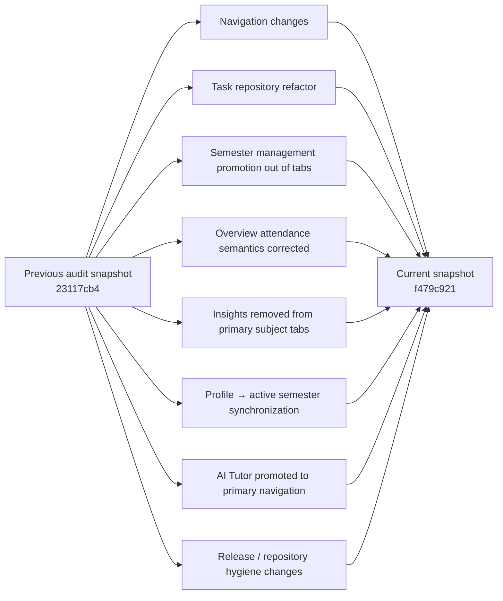
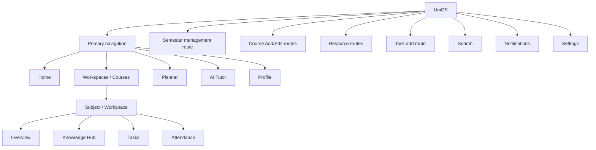

# UniOS — Audit Re-Synchronization / Delta Report

| Field | Value |
| --- | --- |
| Project | UniOS |
| Repository | `aashu035/UniOS` |
| Current default branch | `master` |
| Previous audited snapshot | `23117cb41bd8390dda829a18ab62dcc636d9ab27` |
| Current audited snapshot | `f479c921dabfcdc70a0de049f758d0373486bd03` |
| Current tree SHA | `a93d056ce474a121d3dc7d9915d5ffcb201ecbab` |
| Resync purpose | Re-establish current implementation truth before continuing forensic audit |
| Code changes made by auditor | None |

## 1. Synchronization Result

The repository has changed materially since the Phase 1–4 audits. The old findings are therefore treated as historical evidence only and have been revalidated against the current tree.

### Current repository facts

- The default branch remains `master`.
- Current head is `f479c921dabfcdc70a0de049f758d0373486bd03`.
- The current tree contains the prior audit reports under `Audit/`.
- The current application now has primary navigation for Home, Workspaces, Planner, AI Tutor, and Profile.
- Semester management has moved out of primary tabs and now exists as a real semester-management route under `app/semester/index.tsx`.
- The workspace detail navigation no longer exposes Insights as a primary subject tab.
- Task creation was refactored toward `TaskRepository`, but the current repository does not expose the corresponding `createTask` method.
- Profile semester mutation was extended to update the active-semester record, partially reducing the previous source-of-truth conflict.
- Sentry / Expo Router error instrumentation is present, and the current main layout contains an app-level ErrorBoundary.
- Local development database artifacts are committed under `.freebuff/` in the latest commit.

## 2. High-Level Delta Map

## 3. Added / Modified / Removed / Refactored

| Area | Change in latest code | Disposition |
| --- | --- | --- |
| Primary navigation | Removed `Semester` tab; added `AI Tutor` tab | Significant IA change |
| Semester route | Added/retained real semester-management route under `app/semester/index.tsx` | Functional improvement |
| Task creation | Direct DB insert replaced with `TaskRepository.createTask(...)` | Refactor; currently incomplete |
| Task context | Known `workspaceId` now renders a locked course chip instead of all-course selector | Partial UX improvement |
| Workspace Overview | Alerts card removed; attendance relabelled to `Target Attendance`; dead `View All` removed | Findings partially/fixed |
| Workspace tabs | `Insights` removed from primary subject navigation | Partial completion improvement |
| Profile | Updating `currentSemester` now updates/creates the corresponding active semester | Partial source-of-truth fix |
| Error handling | ErrorBoundary + Expo Router/Sentry instrumentation added | Reliability improvement |
| AI | Tutor now appears as a first-class primary destination | Strategic IA change |
| Repository hygiene | `.freebuff` SQLite DB/WAL/SHM artifacts committed | New release/data-hygiene risk |

## 4. Previous Finding Disposition Matrix

### Phase 1

| ID | Current status | Current interpretation |
| --- | --- | --- |
| P1-01 | STILL VALID | Course / Subject / Workspace terminology remains inconsistent |
| P1-02 | FIXED | Semester is no longer a primary duplicate course-list tab |
| P1-03 | STILL VALID | Add/Edit course lifecycle remains asymmetric |
| P1-04 | STILL VALID | Faculty entry still creates new rows without reuse |
| P1-05 | STILL VALID | Venue entry still creates new rows without reuse |
| P1-06 | STILL VALID | Course edit still omits faculty/venue |
| P1-07 | STILL VALID | UI says Course while destructive action says Workspace |
| P1-08 | STILL VALID | Shared CourseForm is still mode-dependent |
| P1-09 | STILL VALID | Subject functionality remains distributed across domains |
| P1-10 | STILL VALID | Duplicate faculty/venue record path remains |

### Phase 2

| ID | Current status | Current interpretation |
| --- | --- | --- |
| P2-01 | FIXED | Primary navigation no longer duplicates Semester and Workspaces |
| P2-02 | PARTIALLY FIXED | Route-known task context is visually locked, but all workspaces are still fetched |
| P2-03 | STILL VALID | List/detail still maintain separate focus-driven local state |
| P2-04 | FIXED | Hard-coded Alerts card removed |
| P2-05 | PARTIALLY FIXED | Attendance target is correctly labelled, but `Tracking disabled` remains inconsistent |
| P2-06 | FIXED | Dead `View All` affordance removed |
| P2-07 | UNVERIFIED | Global resource routes and Knowledge Hub still exist; responsibility overlap is not fully mapped |
| P2-08 | STILL VALID | Course edit remains narrower than creation and normative requirements |
| P2-09 | PARTIALLY FIXED | Profile mutation now synchronizes active semester; reverse synchronization remains incomplete |

### Phase 3

| ID | Current status | Current interpretation |
| --- | --- | --- |
| P3-01 | PARTIALLY FIXED | Profile → active semester sync added; separate semester activation can still drift profile state |
| P3-02 | PARTIALLY FIXED | Locked context replaces selectable list when route parameter exists, but all workspaces still load |
| P3-03 | STILL VALID | No lookup/reuse path for faculty/venue creation |
| P3-04 | STILL VALID | Distributed screen-local state and focus reloads remain |
| P3-05 | PARTIALLY FIXED | One direction is synchronized; reverse direction remains unresolved |
| P3-06 | STILL VALID | Course mutation surface remains incomplete |
| P3-07 | PARTIALLY FIXED | Some subject context is now preserved, but unnecessary global data reloads remain |

### Phase 4

| ID | Current status | Current interpretation |
| --- | --- | --- |
| P4-01 | FIXED | Duplicate primary navigation surface removed |
| P4-02 | FIXED | Attendance target is now explicitly labelled |
| P4-03 | FIXED | Hard-coded Alerts metric removed |
| P4-04 | FIXED | Non-functional `View All` removed |
| P4-05 | PARTIALLY FIXED | Insights removed from primary subject tabs, but placeholder route remains in code |
| P4-06 | STILL VALID | Home remains an aggregate duplication of canonical content |
| P4-07 | STILL VALID | SubjectCard still performs hidden attendance-domain fetching |
| P4-08 | STILL VALID | Planner empty state still claims tasks are checked although its primary source is calendar events |
| P4-09 | PARTIALLY FIXED | Profile update synchronizes active semester, but reverse semantics still diverge |
| P4-10 | STILL VALID | Search results for tasks/resources still navigate to parent workspace |

## 5. Important Historical Findings That Were Corrected

The resync confirms that several findings from the previous audit were already addressed in the latest code. These must remain in the historical record rather than being re-raised as current bugs:

- Duplicate Semester/Workspaces primary navigation: fixed.
- Hard-coded Overview Alerts metric: fixed.
- Mislabelled Overview attendance target: fixed.
- Dead Overview `View All`: fixed.
- Insights occupying the main subject tab bar: fixed, although the implementation route remains a placeholder.
- Task context is now partially inherited and visually locked when a workspace route parameter is supplied.
- Profile edits now attempt to keep the active semester record synchronized.

## 6. New Regression / Risk Introduced Since Previous Audit

### R-01 — Task repository refactor appears incomplete

`app/task/add.tsx` now calls `TaskRepository.createTask(...)`, while `domains/task/repository.ts` currently exposes only retrieval and status-update methods.

**Status:** Confirmed by static source comparison.

**Severity:** P0.

**Execution caveat:** The auditor did not execute `tsc`; therefore the exact compiler output is not claimed. Given the TypeScript declaration surface, this is nevertheless a direct implementation mismatch and should fail type checking unless another augmentation is present outside the inspected file.

### R-02 — Current-semester synchronization is only one-way

Profile updates now mutate `semesters.isActive`, but `SemesterRepository.updateSemester(..., { isActive: true })` does not update `students.currentSemester`.

**Status:** Confirmed.

**Severity:** P1.

### R-03 — Development SQLite artifacts are committed

`.freebuff/desktop-v2.db`, `.db-shm`, and `.db-wal` are present in the current repository tree.

**Status:** Confirmed artifact presence; actual data sensitivity is unverified.

**Severity:** P1/P2 release and data-hygiene risk.

## 7. Current Product Map — Rebuilt

## 8. Current Domain / Entity Ownership

| Entity | Canonical persistence | Parent / owner | Notes |
| --- | --- | --- | --- |
| Student | `students` | User | Also stores current semester number |
| Semester | `semesters` | Student context | Has `isActive`; competes with profile currentSemester |
| Course / Subject / Workspace | `workspaces` | Semester | Canonical academic entity but terminology remains split |
| Faculty | `faculty` | Referenced by Workspace | Creation path is free-text based |
| Venue | `venues` | Referenced by Workspace | Creation path is free-text based |
| Task | `tasks` | Workspace or optional | Repository currently incomplete |
| Resource | `resources` | Workspace or optional | Add/read/delete present; update not evident |
| Calendar event | `calendar_events` | Schedule / optional Workspace | Latest schema adds faculty override and batch |
| Attendance | `attendance` | Workspace | Rich mark/change flow |
| AI conversation | AI domain tables | AI connection | Local companion / direct mode |

## 9. Current Smart-Context Rules

| Situation | Current behavior | Desired state | Assessment |
| --- | --- | --- | --- |
| Task opened from known workspace | Locked chip; still fetches all workspaces | Reuse route context directly, query only needed entity | Partial |
| Task opened globally | Full course selector | Appropriate | Good |
| Add course semester context | Active semester lookup, profile fallback | Resolve canonical context once | Partial |
| Profile semester changed | Synchronizes active semester | Keep one canonical source | Partial |
| Semester activated independently | Does not update profile currentSemester | Synchronize or eliminate duplicate source | Problem |
| Faculty entered as free text | New faculty row | Search/reuse or explicit create-new | Problem |
| Venue entered as free text | New venue row | Search/reuse or explicit create-new | Problem |

## 10. Current CRUD Risk Summary

| Entity | Create | Read | Update | Delete | Current risk |
| --- | --- | --- | --- | --- | --- |
| Student/Profile | Yes | Yes | Yes | Not evident in UI | Medium |
| Semester | Yes | Yes | Partial | Repository yes, UI absent | P1 |
| Course/Workspace | Yes | Yes | **Partial** | Yes | P1/P0 |
| Faculty | Yes via add-course | Via workspace join | No clear UI/repo mutation | No clear UI/repo mutation | P2/P1 |
| Venue | Yes via add-course | Via workspace join | No clear UI/repo mutation | No clear UI/repo mutation | P2/P1 |
| Task | Intended, but current call targets missing repo method | Yes | Status only | No repo delete | **P0/P1** |
| Resource | Yes | Yes | No clear update | Yes | P1/P2 |
| Attendance | Yes | Yes | Yes/change | Delete not verified | P2 |

## 11. Resync Conclusion

The new codebase is not the same product surface that was audited in Phases 1–4. Several prior defects have been fixed, particularly in primary navigation and misleading Overview widgets.

However, the resync exposes a more serious current problem: some recent refactors have created **implementation incompleteness** while the broader canonical-context issues remain.

The highest-value next attack is therefore no longer visual duplication. It is **functional integrity of the core CRUD flows, especially Course and Task**, followed by state synchronization and destructive operations.

**Resynchronization status: COMPLETE.**