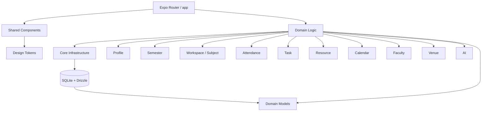
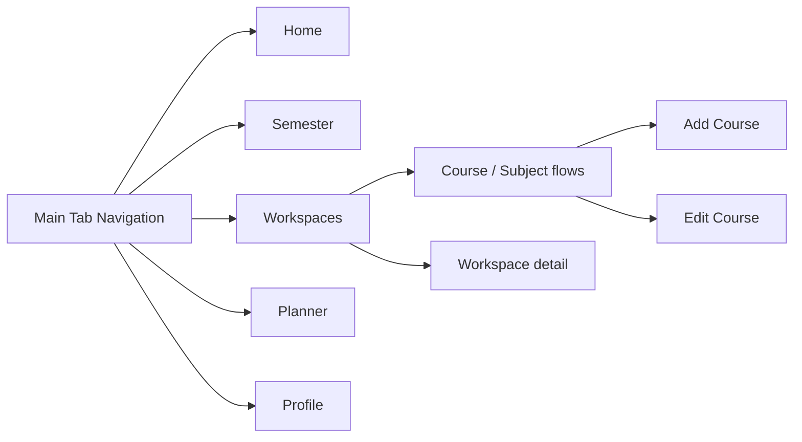
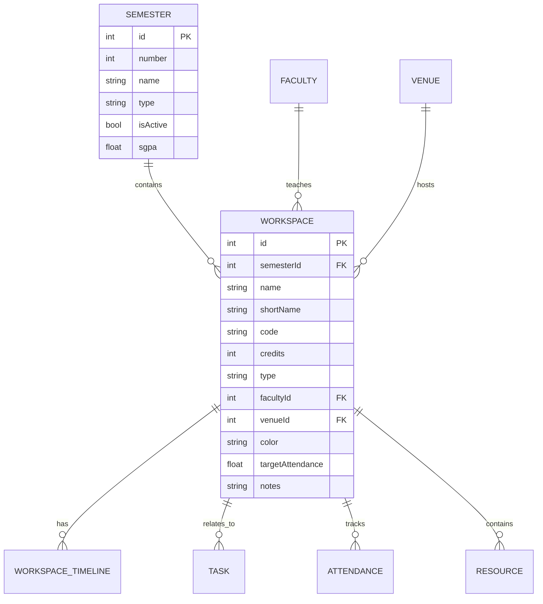
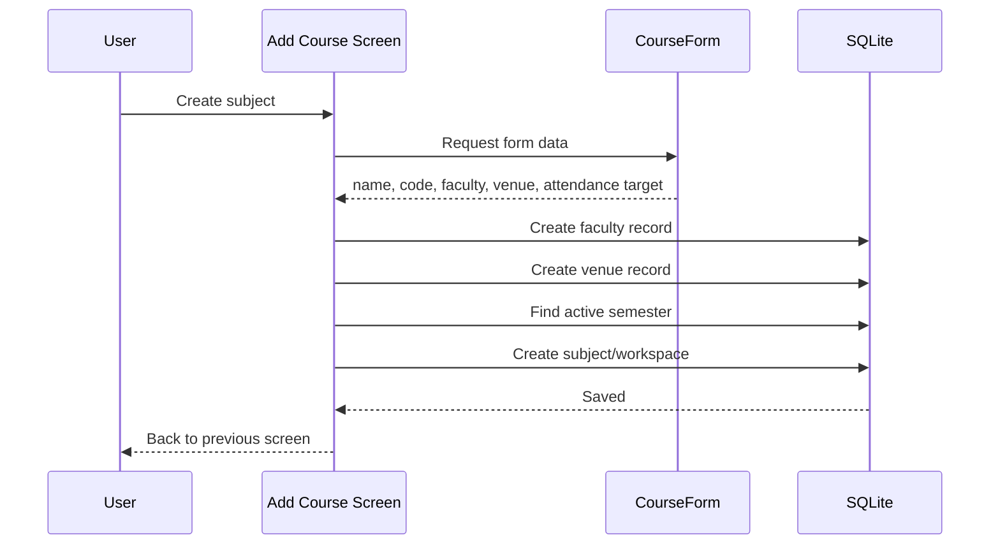
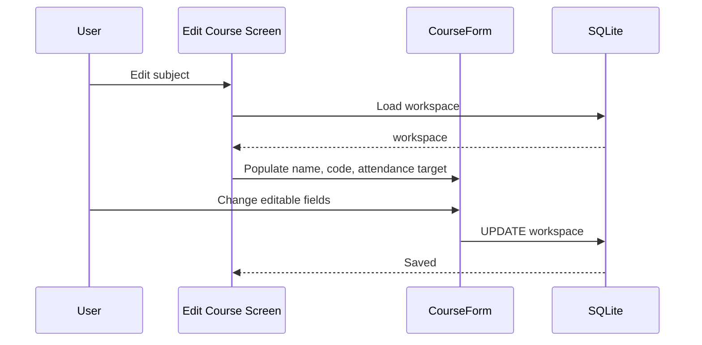
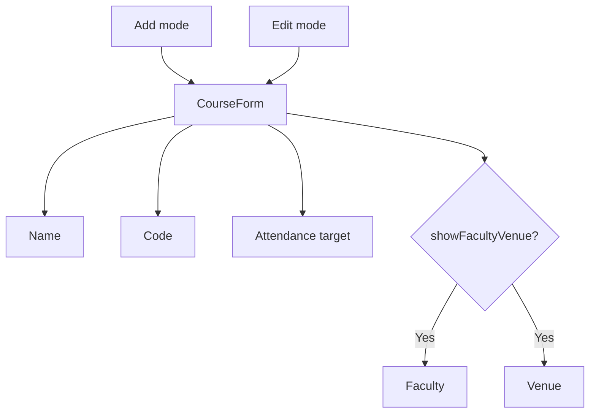
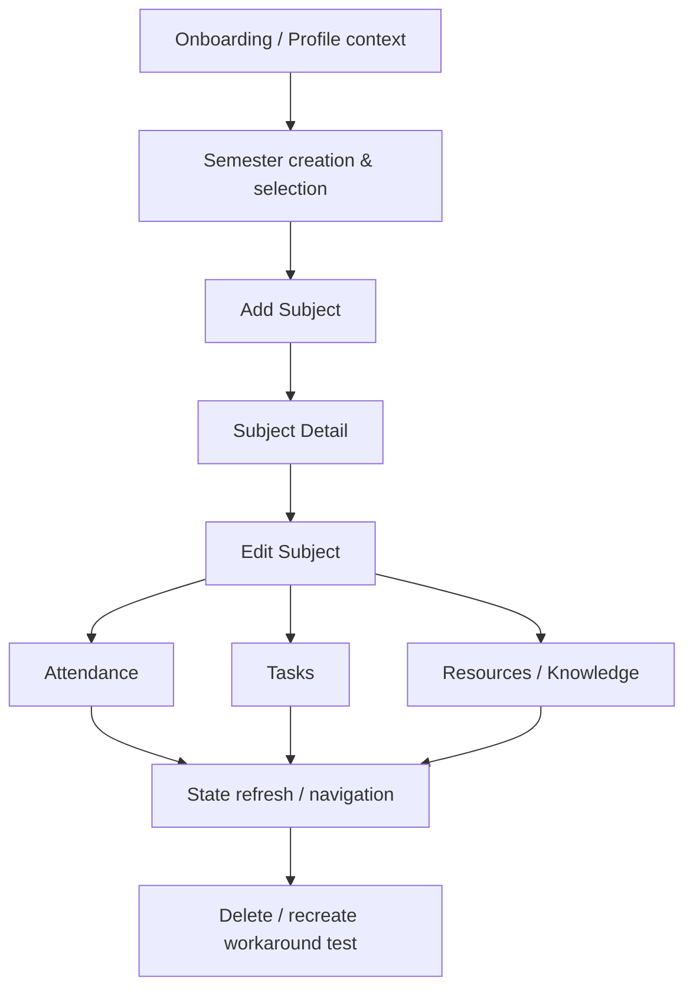

# UniOS — Phase 1 Audit: Architecture & Product Map

| Field | Value |
| --- | --- |
| Project | UniOS |
| Repository | [aashu035/UniOS](https://github.com/aashu035/UniOS) |
| Branch audited | `master` |
| Audit phase | Phase 1 — Architecture & Product Map |
| Audit mode | Forensic structural/code audit |
| Scope | Repository structure, routing, domain model, shared components, subject/course lifecycle, navigation model, initial duplication and editability risks |
| Fixes applied | None — observation and verification only |

## 1. Executive Summary

UniOS currently has a useful domain-oriented foundation: Expo Router screens under `app/`, reusable UI under `components/`, shared infrastructure under `core/`, and feature/domain models under `domains/`. The repository describes the product as an offline-first university companion using Expo, React Native, Drizzle ORM and SQLite.

The principal Phase 1 concern is not an isolated bug. The code shows signs that the central academic concept has not been fully stabilized across the product. A subject is called **Course** in some UI/routes, **Subject** in product comments, and **Workspace** in the internal database/domain layer. This naming split is accompanied by asymmetric create/edit workflows and weak evidence of entity reuse for faculty and venues.

The likely systemic pattern is:

`feature added → local implementation → partial reuse of existing data → parallel UI/route concept → incomplete lifecycle → later workaround`

This pattern is consistent with the user's reported symptoms: duplicate sections, redundant fields, repeated data entry, incomplete sections, and the need to delete/recreate a subject to change information.

## 2. Repository / Architecture Map

The repository exposes core folders for context, database, filesystem and utilities, plus domain folders for AI, attendance, calendar, faculty, notification, profile, resource, semester, task, venue and workspace.

## 3. Navigation Map

### Navigation risk

`Semester` and `Workspaces` are both first-class tabs. Because a workspace/subject is explicitly linked to a semester, these may be two views of one academic hierarchy rather than two genuinely independent product areas. This is a hypothesis for Phase 2, not yet a confirmed UX defect.

## 4. Central Academic Entity Model

The workspace model is explicitly commented as internally called `workspaces` and externally known as `Subjects` for v1. Its fields show that it is a canonical academic object, not just a display card.

## 5. Concept / Terminology Matrix

| Concept | UI / Route name | Internal name | Risk |
| --- | --- | --- | --- |
| Academic subject | Course | Workspace | High |
| Academic subject | Subject | Workspace | High |
| Subject edit | Edit Course | Workspace update | Medium |
| Subject deletion | Delete Workspace | Workspace repository | Medium |

### Finding

The same underlying entity is represented with multiple names. This creates cognitive load for users and increases the chance that new features will be attached to different conceptual abstractions.

## 6. Subject Lifecycle Analysis

The create workflow captures faculty and venue names and immediately inserts records when values are present.

The edit workflow does **not** expose faculty or venue, despite those being available during creation.

## 7. Create vs Edit Matrix

| Field | Add | Edit | Lifecycle status |
| --- | --- | --- | --- |
| Course / subject name | Yes | Yes | Mutable |
| Course code | Yes | Yes | Mutable |
| Faculty | Yes | No | Incomplete edit lifecycle |
| Venue / room | Yes | No | Incomplete edit lifecycle |
| Attendance target | Yes | Yes | Mutable |
| Credits | Not exposed | Not exposed | Potentially inaccessible |
| Type | Not exposed | Not exposed | Potentially inaccessible |
| Color | Not exposed | Not exposed | Potentially inaccessible |
| Notes | Not exposed | Not exposed | Potentially inaccessible |

This is the strongest confirmed Phase 1 evidence for the reported immutability/workaround problem: the entity has an edit route, but the edit surface is materially narrower than the create surface.

## 8. Smart Reuse / Deduplication Risk Matrix

| Input | Current behavior observed | Desired product behavior | Risk |
| --- | --- | --- | --- |
| Faculty name | Insert new faculty row when non-empty | Search existing faculty; reuse or explicitly create new | High duplicate-record risk |
| Venue name | Insert new venue row when non-empty | Search existing venue; reuse or explicitly create new | High duplicate-record risk |
| Active semester | Reuse existing active semester if present | Continue using canonical semester context | Good foundation |
| Profile semester fallback | Create semester from profile when no active semester exists | Derive/reuse canonical semester context before creating | Needs lifecycle verification |

The faculty and venue insertion paths are especially important because they demonstrate a missing contextual-reuse decision at the data layer, not just a cosmetic form problem.

## 9. Component / Form Architecture

`CourseForm` is shared across add and edit flows. It supports conditional display through `showFacultyVenue` and `showTargetAttendance`.

This reuse is good structurally, but the same form component currently represents two materially different entity lifecycles. That should be revisited after the complete field ownership model is established.

## 10. Initial Findings Register

| ID | Finding | Category | Severity | Confidence | Status |
| --- | --- | --- | --- | --- | --- |
| P1-01 | Course / Subject / Workspace terminology is inconsistent | Product model / UX | High | Confirmed | Open |
| P1-02 | Semester and Workspaces may overlap as top-level product views | Information architecture | Medium–High | Hypothesis | Verify Phase 2 |
| P1-03 | Add and Edit subject workflows are asymmetric | Functional UX | High | Confirmed | Open |
| P1-04 | Faculty creation does not show existing-entity reuse | Data / smart reuse | High | Confirmed | Verify full domain behavior |
| P1-05 | Venue creation does not show existing-entity reuse | Data / smart reuse | High | Confirmed | Verify full domain behavior |
| P1-06 | Edit workflow does not expose faculty or venue | Editability | High | Confirmed | Open |
| P1-07 | Delete action uses Workspace terminology while UI uses Course | UX consistency | Medium | Confirmed | Open |
| P1-08 | Shared form hides different fields by workflow mode | Component / lifecycle | Medium | Confirmed | Investigate after field ownership audit |
| P1-09 | Central subject functionality is distributed across many domains | Architecture | Medium | Confirmed | Map in Phase 2/3 |
| P1-10 | Potential duplicate faculty/venue records can be produced by repeated entry | Data integrity | High | Strong evidence | Verify with repositories / constraints |

## 11. Confirmed Facts vs Hypotheses

### Confirmed in Phase 1

- UniOS uses an Expo Router + domain-oriented structure.
- A central `workspaces` entity represents subjects/courses.
- `workspaces` is linked to semesters, faculty and venues.
- Add and Edit flows expose different field sets.
- Edit does not expose faculty or venue.
- Add flow inserts faculty and venue records from free-text names.
- The UI and internal domain layers use different names for the same academic object.

### Hypotheses requiring verification

- `Semester` and `Workspaces` are redundant user-facing sections.
- Faculty and venue duplicates are already present in stored data.
- Several sections elsewhere in the app implement overlapping functionality.
- State refresh after edits is incomplete across subject-related screens.
- Some domain fields are unreachable through normal UI.

## 12. Phase 2 Investigation Sequence

Phase 2 should focus only on the **Subject/Semester lifecycle** and follow the data through each screen and repository operation.

## 13. Recommended Audit Discipline

1. Verify the lifecycle before proposing redesign.
2. Treat Subject/Workspace as a candidate canonical entity and trace every consumer.
3. Record duplicate data creation paths before adding deduplication logic.
4. Distinguish immutable-by-design fields from merely missing edit controls.
5. Verify state propagation after every mutation.
6. Do not merge or remove sections until their underlying responsibilities are mapped.

## 14. Phase 1 Conclusion

The project is not structurally irrecoverable. In fact, the separation between router, components, domains and core infrastructure gives us a workable base for systematic repair.

The main architectural risk is **conceptual drift around the central academic entity and its lifecycle**. The strongest current evidence points to a subject model that is more complete in the database than in the UI, combined with insufficient reuse of canonical faculty/venue data and inconsistent product terminology.

The next audit phase should therefore trace **Semester → Subject → Subject Detail → Edit → Attendance/Tasks/Resources → navigation/state** before any broad refactoring or UI consolidation is attempted.

---

## Evidence Notes

Repository metadata identifies UniOS as an Expo/React Native + Drizzle ORM + SQLite application and shows the `master` branch as the default branch. The recursive repository structure includes `app`, `components`, `core`, `domains`, and related project files. The subject/workspace model explicitly links subjects to semesters, faculty and venues. The add and edit screens implement the asymmetric lifecycle described above.

**Phase 1 disposition:** Complete. No code changes made.