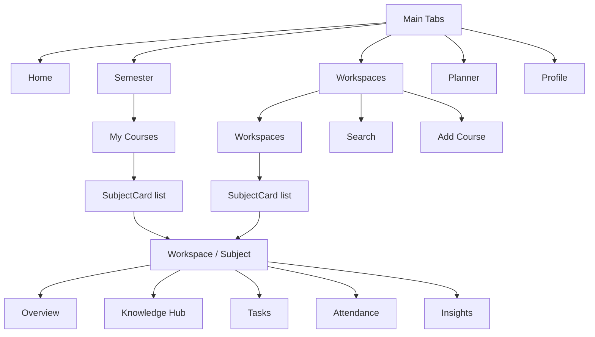
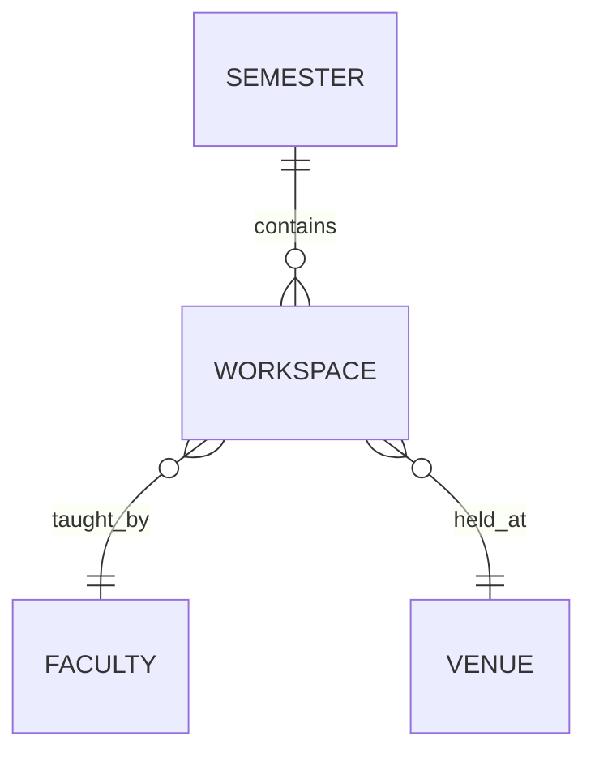
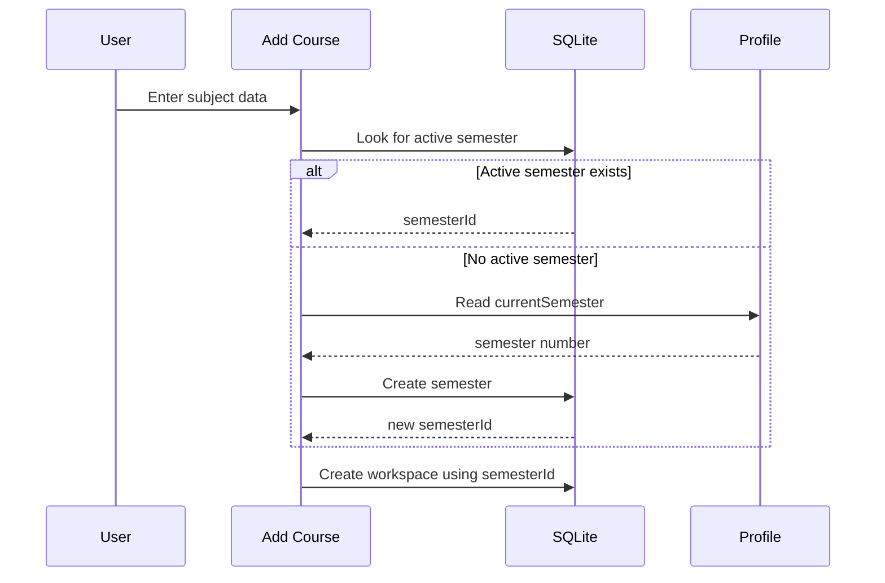
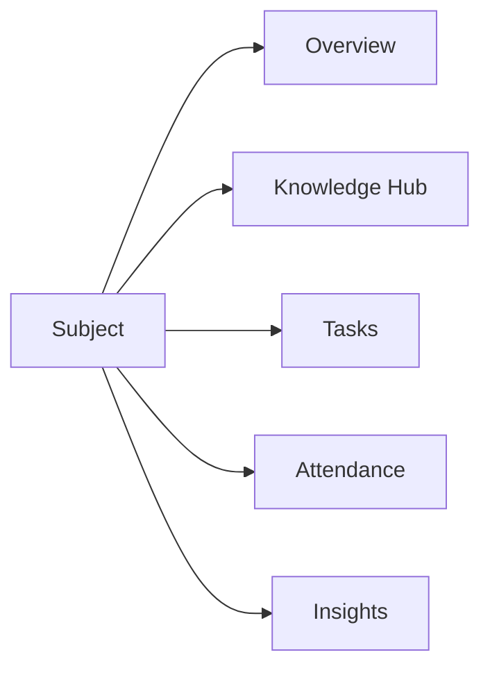
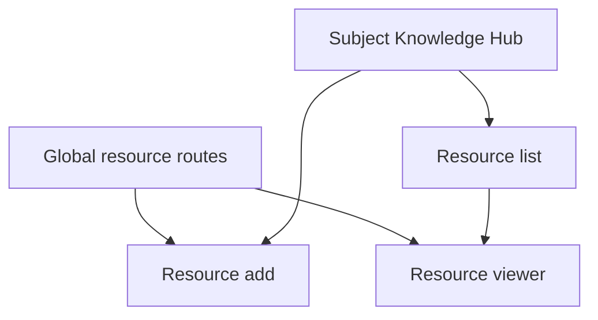
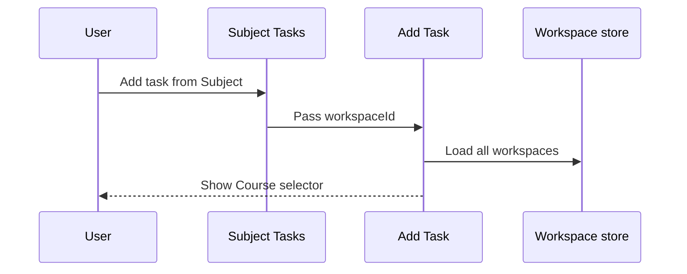
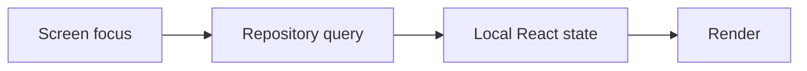
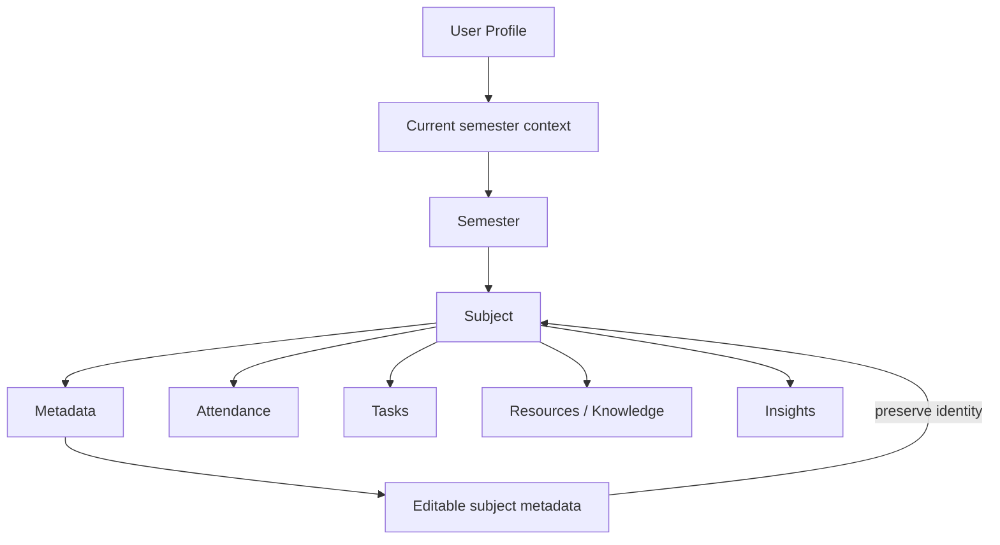
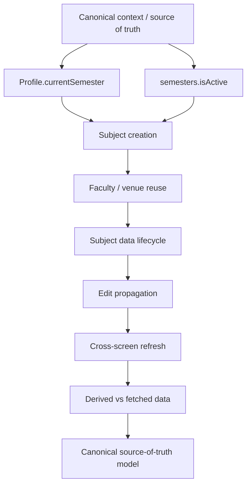

# UniOS — Phase 2 Audit: Subject & Semester Lifecycle

| Field | Value |
| --- | --- |
| Project | UniOS |
| Repository | [aashu035/UniOS](https://github.com/aashu035/UniOS) |
| Branch | `master` |
| Phase | Phase 2 — Subject & Semester Lifecycle |
| Scope | Semester tab, Workspaces tab, subject creation, subject overview, subject sub-features, edit lifecycle, task creation context, attendance flow, refresh/state behavior |
| Phase 1 dependency | P1-01 through P1-10 |
| Code changes | None |

## 1. Executive Finding

Phase 2 confirms a major information-architecture problem that was only a hypothesis in Phase 1:

> **The `Semester` and `Workspaces` top-level tabs currently implement substantially the same user-facing function: listing courses/subjects. The `Semester` screen does not actually read or render semester entities.**
> 

The `Semester` screen calls `useWorkspaces()`, titles itself `My Courses`, and renders the same `SubjectCard` pattern used by the `Workspaces` screen. It therefore behaves as another course list rather than a semester-management surface.

This is a confirmed redundancy, not merely a design preference.

## 2. Current User-Facing Information Architecture



## 3. Confirmed Duplicate Section: Semester vs Workspaces

### Evidence

The `Semester` screen imports and calls `useWorkspaces()` rather than a semester hook, displays the title `My Courses`, and maps workspaces directly into `SubjectCard` components.

The `Workspaces` screen also calls `useWorkspaces()`, maps the resulting workspaces into the same `SubjectCard`, and provides the Add Course action.

### Functional comparison matrix

| Capability | Semester tab | Workspaces tab | Difference |
| --- | --- | --- | --- |
| Reads subjects/courses | Yes | Yes | None |
| Uses SubjectCard | Yes | Yes | None |
| Opens subject workspace | Yes | Yes | None |
| Add course | Yes | Yes | Both lead to same add flow |
| Actual semester records | No evidence | No | Neither manages semester entities |
| Semester-specific filtering | No | No | Global workspace list |
| Search | No | Yes | Only Workspaces has it |
| User-facing semantic distinction | "Semester" | "Workspaces" | Terminology only |

### Finding P2-01 — Confirmed

**Severity:** P0/P1 product architecture issue

The `Semester` tab is functionally a duplicate course/subject listing. It consumes a primary navigation slot without representing the semester entity it is named after.

This explains one of the user's original complaints about sections doing similar work while consuming space and causing confusion.

## 4. The Real Data Hierarchy Is Not Reflected in Navigation

The database model supports a meaningful hierarchy:



But the current UI instead behaves like:

```
Semester tab
    ↓
All Workspaces

Workspaces tab
    ↓
All Workspaces
```

The semester-to-subject relationship exists in persistence, but the primary navigation does not expose that relationship.

This is a classic **domain-model/UI-model divergence**.

## 5. Subject Creation Context

The add-course flow does correctly attempt to establish a semester context by searching for an active semester.



### Important observation

The user is not asked to select a semester in the Add Course UI, which can be good UX when a canonical current-semester context already exists.

However, the application appears to have two separate concepts:

`Profile.currentSemester`

and

`semesters.isActive`

These need to be reconciled into one authoritative source of current-semester context in Phase 3.

## 6. Subject Overview Audit

The subject workspace header contains the subject name, a back action, an edit/settings action, and five top-level tabs: Overview, Knowledge Hub, Tasks, Attendance, Insights.



### Overview findings

The Overview currently shows:

- Attendance target
- Alerts
- Faculty
- Subject timeline

The Attendance stat reports a target percentage and a `Tracking disabled` trend, even though a full Attendance tab exists and the workspace attendance implementation can actively mark and change attendance.

The Alerts value is hard-coded to `0` in the current overview implementation.

These are indications of **incomplete or placeholder functionality** and should not be presented as complete analytical widgets.

## 7. Placeholder / Incomplete Overview Matrix

| Overview element | Implementation state | User risk | Phase 2 status |
| --- | --- | --- | --- |
| Attendance target | Reads targetAttendance | Moderate: may be mistaken for current attendance | Confirmed concern |
| "Tracking disabled" trend | Static text | Conflicts with live Attendance feature | Confirmed inconsistency |
| Alerts count | Hard-coded `0` | False sense of completeness | Confirmed placeholder |
| Subject Timeline | Loads timeline records | Potentially useful | Implemented |
| "View All" timeline action | Label supplied without `onActionPress` | Looks interactive but no action is wired by `SectionHeader` | Confirmed inactive control |

The `SectionHeader` component renders `actionLabel` only when `onActionPress` is also provided. The Overview supplies `actionLabel="View All"` without a handler, so the intended action is not rendered as an active control.

## 8. Knowledge Hub vs Other Resource Surfaces

The subject workspace contains a dedicated `Knowledge Hub` which presents `All Resources & Notes` and allows adding, opening, and deleting resources.

This is a coherent subject-scoped surface.

However, the repository also has a global `resource` route family and resource add/viewer screens. The full duplication question cannot yet be resolved, but this is a second likely area where a resource feature may have multiple entry points or responsibilities.

Phase 3 should trace:



The critical question is whether the global route is merely a technical detail or a second user-facing resource management surface.

## 9. Tasks: Context Reuse Works, But Selection Is Still Exposed

The Subject Tasks screen receives a `workspaceId` route parameter and navigates to Task Add with that context.

The Task Add screen also loads **all workspaces** and renders a course selector.



### Finding P2-02

When adding a task from inside a specific subject, the app already knows the subject. Requiring or prominently presenting another course selector is a **context-redundancy risk**.

The current implementation initializes the selected workspace from the passed route parameter, which is good, but it still loads and renders every workspace.

This is a concrete example of the user's request for smarter context reuse.

Desired behavior:

```
Entered from Subject X
        ↓
Course = Subject X
        ↓
Do not ask again unless user explicitly chooses "Change course"
```

## 10. Subject Attendance: Stronger Editability Than Subject Metadata

Attendance has a surprisingly more complete mutation model than the parent subject metadata.

The user can:

- Mark Present
- Mark Absent
- Mark Other
- mark Exempt
- mark Cancelled
- mark Holiday
- Change an existing record

This demonstrates that UniOS is capable of supporting **mutable historical records**, even though the parent Subject edit form is narrower.

That contrast is important: the immutability problem is not caused by a fundamental application limitation. It is likely an incomplete lifecycle design around the subject entity.

## 11. Attendance Context / Data Risk

The attendance screen obtains subject context twice:

1. `useAttendance(workspaceId)`
2. `useWorkspace(workspaceId)`

It therefore separately loads attendance data and the parent workspace data just to retrieve the target attendance.

This may be valid because they are different domains, but it is a candidate for a shared subject context/cache in Phase 3.

The screen also uses both locally calculated attendance metrics and optional portal values, which creates another source-of-truth question:

```
Local history → calculated metrics
Portal data   → optional display metrics
```

Phase 3 should determine which source is authoritative and whether fallback logic can produce contradictory numbers.

## 12. State / Refresh Pattern

The workspace hooks use `useFocusEffect` to refresh both lists and details.



This is a pragmatic solution for an offline-first application, but it is also a potential source of repeated queries and stale cross-screen state because there is no evident shared workspace cache in the inspected hooks.

`useWorkspaces()` and `useWorkspace(id)` maintain separate local state.

### Finding P2-03

A subject mutation can update the detail screen's local query result without automatically updating another screen's copy until focus-triggered refresh occurs.

This should be tested systematically in Phase 3, especially:

`Edit Subject → Back → Workspace list → Home → Subject detail → Attendance`

## 13. Subject Delete Semantics

The workspace repository deletes the workspace row directly. The model declares cascading behavior for `workspaceTimeline`, and the repository comments indicate that foreign-key cascading is expected to remove related tasks, resources, attendance and timeline records.

The edit screen warns the user that deleting the workspace can delete tasks, materials and timeline events and that the action cannot be undone.

This confirms that the delete operation is **high-impact and destructive**.

Because the edit surface is incomplete, the current product can create a bad incentive:

```
Need to change inaccessible subject metadata
                ↓
Cannot edit it
                ↓
Delete entire workspace
                ↓
Recreate subject
                ↓
Risk losing linked data
```

This is the exact lifecycle defect we need to resolve before considering deletion UX complete.

## 14. Findings Register — Phase 2

| ID | Finding | Severity | Confidence | Disposition |
| --- | --- | --- | --- | --- |
| P2-01 | Semester tab duplicates Workspaces subject listing instead of managing semesters | P0 | Confirmed | Redesign candidate |
| P2-02 | Add Task shows a full course selector even when launched from a known subject | P1 | Confirmed | Context reuse issue |
| P2-03 | Workspace list and detail use separate focus-driven local state instead of a shared subject source | P1/P2 | Confirmed architecture pattern | Verify stale-state cases in Phase 3 |
| P2-04 | Overview Alerts count is hard-coded to zero | P1 | Confirmed | Incomplete functionality |
| P2-05 | Overview attendance messaging conflicts with live Attendance feature | P1 | Confirmed | UX/data trust issue |
| P2-06 | Overview timeline exposes "View All" without a wired action | P2 | Confirmed | Dead/incomplete affordance |
| P2-07 | Global resource routes and subject Knowledge Hub need responsibility mapping | P2 | Hypothesis | Investigate Phase 3/4 |
| P2-08 | Subject edit remains materially narrower than subject creation | P1 | Confirmed | Continue lifecycle audit |
| P2-09 | Profile.currentSemester and active semester are separate contextual sources | P1 | Strong evidence | Resolve source of truth Phase 3 |

## 15. Revised Subject Lifecycle Model

The intended user model should likely become:



The current implementation instead partially distributes the same concept across profile, semester and workspace contexts.

## 16. Phase 3 Investigation Sequence



## 17. Phase 2 Conclusion

Phase 2 materially strengthens the Phase 1 diagnosis.

The largest confirmed UX defect is **not merely that two screens look alike**. It is that a screen labelled `Semester` is actually another subject list. This means the application's navigation hierarchy is not expressing its data hierarchy.

The second important pattern is **context loss**. When a user enters a workflow from a known subject, downstream screens sometimes still load and expose the complete set of candidate subjects instead of treating the current subject as established context.

The third pattern is **partial completeness**: some features such as attendance have rich mutation paths, while overview and subject metadata management remain placeholders or partial implementations.

The next phase should therefore stop looking primarily at screen layout and instead establish the canonical data/context model: what UniOS knows about the current user, current semester, current subject, related faculty/venue, and how each screen should reuse that information without stale or duplicated state.

---

## Phase 2 disposition

**Complete.** No code changes were made. Findings are evidence-backed and separated from hypotheses. Phase 3 begins with source-of-truth, contextual reuse, deduplication, and state propagation.