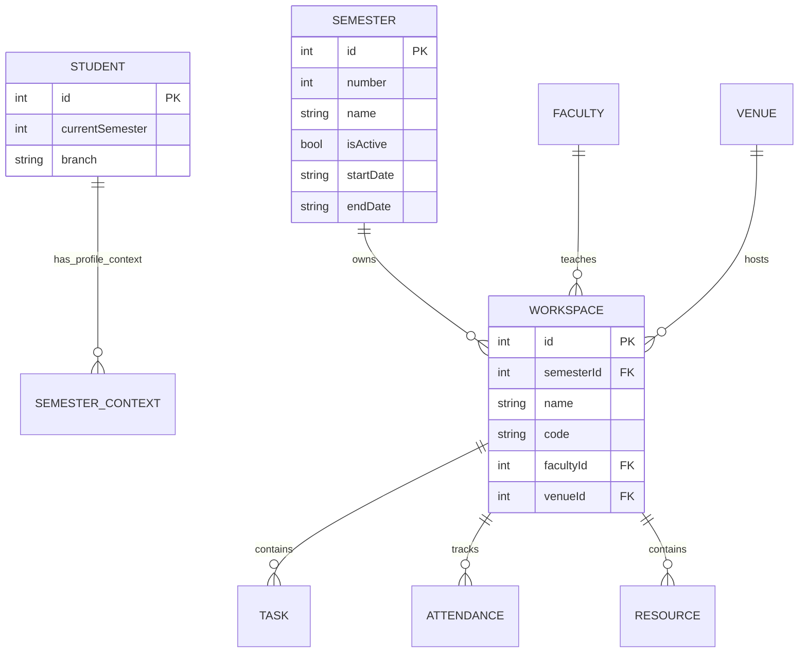
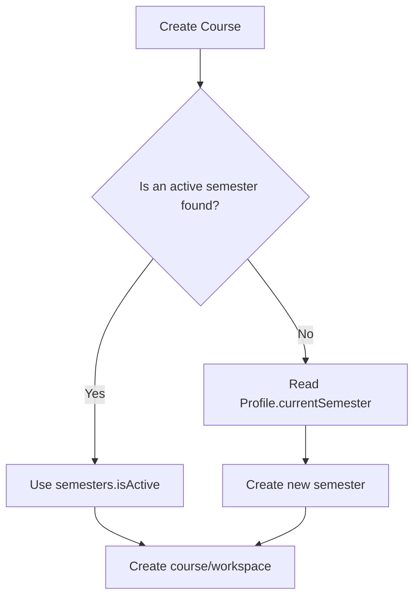
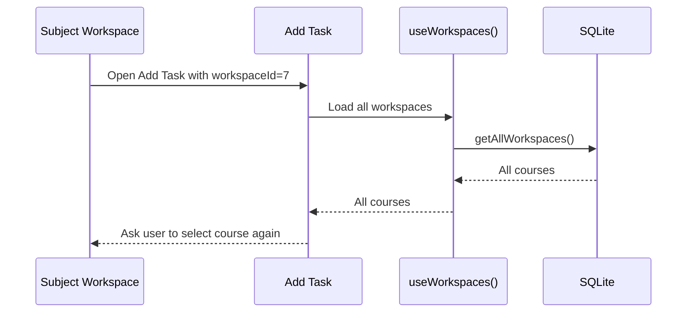
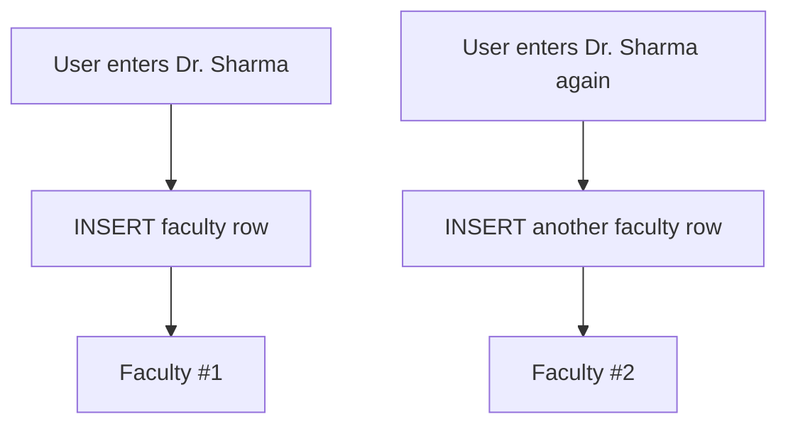
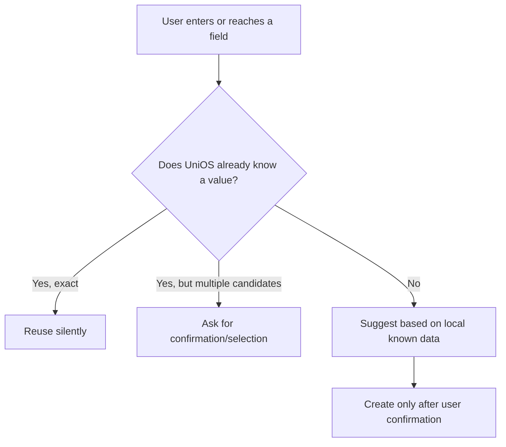
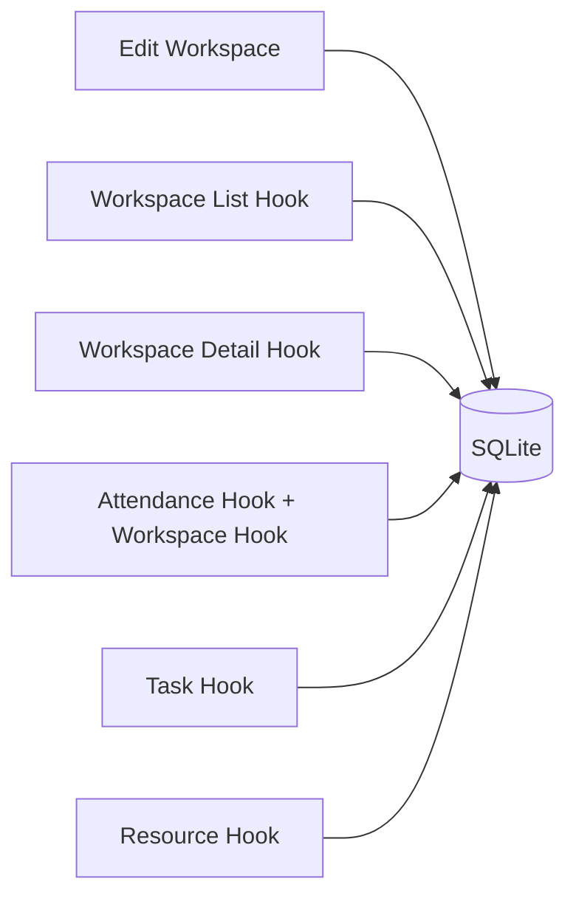
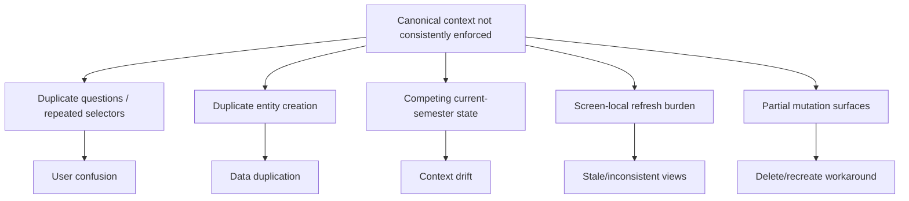

# UniOS — Phase 3 Audit: Data, State & Smart Reuse

| Field | Value |
| --- | --- |
| Project | UniOS |
| Repository | [aashu035/UniOS](https://github.com/aashu035/UniOS) |
| Branch | `master` |
| Phase | Phase 3 — Data, State & Smart Reuse |
| Focus | Canonical data sources, duplicate creation, contextual reuse, fetch/state propagation, destructive workarounds |
| Fixes applied | None — audit only |

## 1. Executive Summary

Phase 3 confirms that many of the reported UX problems have a **data-flow root cause** rather than being isolated screen-design defects.

The most important pattern is the absence of one clearly enforced canonical context object for the user's current academic state. UniOS currently stores semester context in the profile (`currentSemester`) while also maintaining a separate `semesters` table with `number`, `name`, and `isActive`. The course creation path first looks for an active semester and only falls back to the profile semester, creating a semester if none exists. This creates two competing sources of truth.

The same pattern appears at smaller scales:

`known context → screen receives context → screen fetches broader dataset again → user must select something already known`

The clearest confirmed example is task creation. A task created from a subject workspace already receives `workspaceId`, yet `AddTask` still loads all workspaces and presents a course selector. When opened from a subject, the app therefore asks the user to select the context it already has.

There is also a clear entity deduplication weakness: adding a course inserts a new faculty row and a new venue row directly from free-text input, with no demonstrated lookup/reuse step. Faculty and venue are separate entities, so repeated entry can create duplicate records.

## 2. Canonical Data Model



### Canonicality assessment

| Context | Current source | Assessment |
| --- | --- | --- |
| Student identity | `students` | Canonical enough |
| Current semester | `students.current_semester`  • `semesters.isActive` | **Competing sources** |
| Subject identity | `workspaces` | Canonical entity, but naming is inconsistent |
| Faculty | `faculty` | Entity exists, but creation path lacks reuse |
| Venue | `venues` | Entity exists, but creation path lacks reuse |
| Subject list | `WorkspaceRepository.getAllWorkspaces()` | Canonical read path |
| Subject detail | `WorkspaceRepository.getWorkspaceById()` | Canonical read path |
| Task context | `workspaceId` plus reloaded workspace list | **Redundant context acquisition** |

## 3. Source-of-Truth Conflict: Current Semester

The student profile stores a `currentSemester` integer. The semester table independently stores semester records and an `isActive` flag.

The add-course workflow does this:



This means the application can represent two different answers to the question:

> "Which semester is the student currently working in?"
> 

One comes from the profile; another comes from an active semester row.

### Finding P3-01 — Competing semester context

**Severity:** P1

**Impact:** A semester switch can become ambiguous unless every consumer consistently derives current context from the same source. This can lead to courses being attached to an unexpected semester or screens displaying a different context from the profile.

The SRS explicitly defines Semester as the owner of multiple courses and requires semester management, which reinforces the need for the semester entity to be a first-class source of truth rather than a fallback side effect of course creation.

## 4. Context Leakage: Add Task

The Add Task route receives a `workspaceId` parameter from the subject workspace.

However, the screen then loads the complete workspace list with `useWorkspaces()` and renders every course as selectable chips.



### Finding P3-02 — Redundant context selection

**Severity:** P1

**Confirmed behavior:** When opened from a subject, task creation already has the subject identifier but still displays a course selector.

**UX principle violated:** Known context should be reused unless the workflow intentionally supports changing context.

### Correct conceptual behavior

```
Subject → Add Task
        ↓
workspaceId is already known
        ↓
Task is implicitly associated with that subject
        ↓
No second course-selection step
```

A separate "Change course" action could exist only if the task is designed to move between courses.

## 5. Context Reuse Matrix

| Workflow | Context already known? | Current behavior | Recommended semantic rule | Risk |
| --- | --- | --- | --- | --- |
| Add task from subject | Yes — `workspaceId` | Reloads and displays all workspaces | Lock to current subject by default | High |
| Add resource from Knowledge Hub | Yes — workspace route | Passes workspace ID to add route | Keep course implicit; allow explicit change only if needed | Medium |
| Add course | Active semester may be known | Queries active semester, then profile fallback | Resolve canonical semester once | High |
| Subject detail | Yes — workspace ID | Fetches workspace detail and timeline | Use canonical workspace context; refresh only when invalidated | Medium |
| Attendance | Yes — workspace ID | Loads attendance plus workspace data separately | Shared subject context/cache | Medium |

## 6. Duplicate Faculty / Venue Creation

The course creation flow creates a faculty record whenever `facultyName` is non-empty and creates a venue record whenever `venueName` is non-empty.

The entity models contain no visible uniqueness constraint that would prevent repeated names from being stored as separate rows.



The same pattern exists for venues.

### Finding P3-03 — Entity duplication path

**Severity:** P1

**Evidence:** Faculty and venue are normalized entities, but the creation path treats free-text entry as a new-entity instruction rather than a search/reuse decision.

### Product-level implication

The UX should not force the user to understand the distinction between:

- **select an existing faculty member**
- **create a new faculty member**

The app should perform the lookup automatically and expose an explicit "Create new" path only when no suitable match exists.

## 7. Smart Detection Model

A useful UniOS rule should be:



### Recommended confidence hierarchy

| Situation | App behavior |
| --- | --- |
| Exact known context from route | Reuse; don't ask again |
| Single exact local entity match | Preselect/reuse |
| Multiple plausible matches | Ask user to choose |
| Fuzzy match | Suggest, don't silently overwrite |
| No match | Allow creation |
| Ambiguous inference | Require explicit confirmation |

This aligns with the SRS principle that AI/suggestions are not confirmation; the app should distinguish suggestion from explicit student action.

## 8. State Propagation Architecture

UniOS frequently uses `useFocusEffect` to reload data when a screen gains focus. This provides a practical baseline for cross-screen refresh, but it is not the same as a shared canonical store.

For workspaces, `useWorkspaces()` loads all workspaces on focus and `useWorkspace(id)` independently loads one workspace and its timeline on focus.



The current architecture can therefore produce short-lived stale states whenever one screen mutates an entity and another screen has its own independently loaded copy.

### Finding P3-04 — Distributed screen-local state

**Severity:** P1/P2 depending on workflow

This is not inherently a bug because focus-based refresh mitigates it. The risk is architectural: each screen owns its own read lifecycle rather than consuming an invalidation-aware canonical store.

## 9. Profile Mutation and Context

The profile hook maintains its own local `profile` state and exposes `updateProfile`, which updates the database and immediately updates the hook state.

The model contains `currentSemester`, and the edit screen allows the user to change it independently from the semester entity.

This means a user can modify:

`Profile.currentSemester = 5`

without an equivalent guaranteed mutation to:

`Semester #5 → isActive = true`

unless some other flow reconciles the two.

### Finding P3-05 — Profile/semester synchronization risk

**Severity:** P1

The current-semester value is editable from Profile while semester activation is a separate concept. That is a likely source of context drift.

## 10. Data Fetching Matrix

| Screen | Primary data | Secondary fetches | Potentially redundant? |
| --- | --- | --- | --- |
| Workspaces | All workspaces | None | No |
| Subject Overview | Workspace + faculty + venue | Timeline | Acceptable, but two reads |
| Knowledge Hub | Workspace resources | None | No |
| Tasks | Workspace tasks | Focus refresh | Expected |
| Attendance | Attendance history | Workspace + class schedule | Potential duplication of workspace read |
| Add Task | Known workspace ID | All workspaces | **Yes — confirmed** |

## 11. Editability / Mutation Model

The SRS states that a course shall be editable with name, code, credits, type, instructor, default venue, attendance target, colour and notes.

The current edit form visibly updates only name, code and attendance target.

This makes the problem stronger than a UI omission: there is a **requirements-to-implementation gap** in the mutation surface.

### Finding P3-06 — Mutable entity with incomplete mutation surface

**Severity:** P0/P1

**Why this matters:** The user experiences the entity as effectively immutable even though the database can technically be updated. This is precisely the type of failure that causes delete-and-recreate workarounds.

## 12. Data Intelligence Rules That UniOS Should Adopt

### Rule A — Route context wins

If a route already identifies a subject, task, resource, or other parent entity, downstream forms should inherit that context by default.

### Rule B — Stored entity beats free text

When a user enters a known faculty/venue/entity, search and reuse before creating another row.

### Rule C — One canonical current-semester source

The application should not independently decide "current semester" from profile state and active-semester state without an explicit synchronization contract.

### Rule D — Mutation invalidates dependents

After an entity update, affected list/detail/summary queries should be invalidated or refreshed from one shared mechanism.

### Rule E — Derived values should not be persisted twice without a reason

If one value can be deterministically derived from canonical semester data, avoid maintaining an independent competing value.

## 13. Phase 3 Findings Register

| ID | Finding | Severity | Confidence | Status |
| --- | --- | --- | --- | --- |
| P3-01 | Profile.currentSemester and semesters.isActive are competing current-semester sources | P1 | Confirmed | Open |
| P3-02 | Add Task re-asks for course context already supplied by workspaceId | P1 | Confirmed | Open |
| P3-03 | Faculty and venue free-text creation lacks visible lookup/reuse | P1 | Confirmed | Open |
| P3-04 | Screen-local state and focus reloads create distributed consistency responsibility | P1/P2 | Confirmed architecture | Needs lifecycle testing |
| P3-05 | Profile semester editing can drift from active semester state | P1 | Strong evidence | Verify with device flow |
| P3-06 | Course edit surface does not satisfy the canonical requirements for course mutation | P0/P1 | Confirmed | Open |
| P3-07 | Subject-centric flows do not consistently reuse known parent context | P1 | Confirmed pattern | Expand in Phase 4/5 |

## 14. Root-Cause Model



## 15. Phase 4 Entry Point

Phase 4 should now stop looking primarily at individual fields and instead audit **visual information architecture and interaction density** against the data model discovered here.

Priority targets:

1. Semester vs Workspaces duplicate presentation.
2. Subject Overview content density and usefulness of each card/section.
3. Knowledge Hub vs global Resource surfaces.
4. Tasks / Planner overlap.
5. Attendance summary duplication between Overview and Attendance.
6. Repeated section headers and action affordances.
7. Empty/loading/error states against the canonical data rules.

**Phase 3 disposition:** Complete. No code changes made.