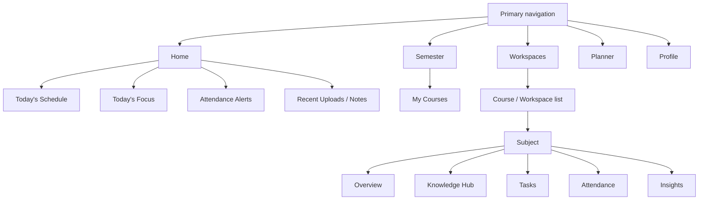
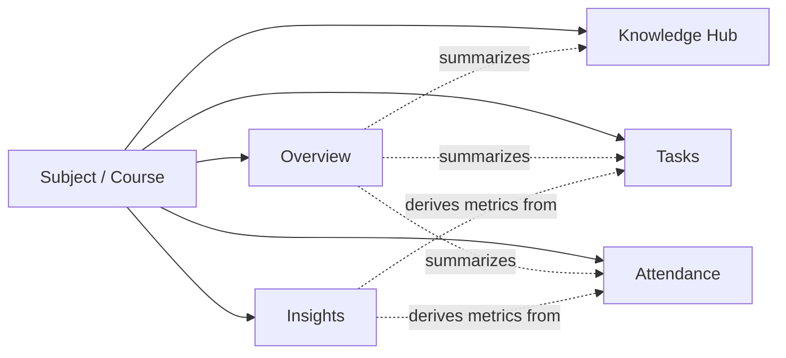
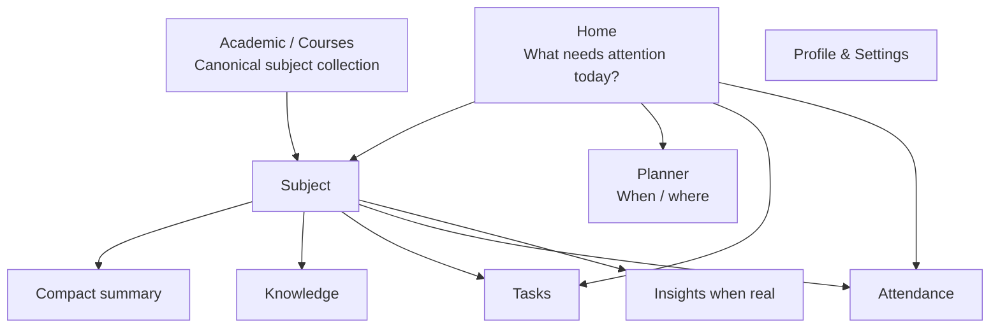

# UniOS — Phase 4 Audit: UI, UX & Information Architecture

Phase 4 examines the presentation layer and information architecture after Phases 1–3 established the product/domain model. The audit focuses on redundancy, information density, incomplete sections, misleading states, discoverability, and whether the UI exposes the correct context at the correct moment.

**No code changes were made.**

## 1. Executive Summary

The UI is not primarily suffering from isolated styling defects. The deeper problem is **information architecture drift**: several screens surface the same underlying information from different angles, while some supposedly distinct sections are placeholders or incomplete. This increases navigation cost without proportionally increasing user value.

The most significant UX finding remains the duplication between the `Semester` and `Workspaces` tabs. The former is actually a course/subject list and uses the same `useWorkspaces()` data as the latter. This means the primary navigation presents two destinations for essentially the same content.

Within a subject, the five-tab structure is reasonable in concept, but the current Overview and Insights surfaces are not yet strong enough to justify all of their space. Overview contains static or misleading information, while Insights is almost entirely placeholder content. The result is a product that has **more sections than completed capabilities**.

The Home screen also aggregates schedule, tasks, attendance, and recent resources into a long vertical briefing. Some of that is useful, but the current information model causes cards to repeat information that users can reach elsewhere, especially subject cards and resources. The key product question is therefore not “what else should be added?” but “what information deserves to appear here, and what should remain one tap away?”

## 2. Information Architecture Map



The current product has three different presentation levels for the same academic information:

`Home → Subject summary`, `Semester → course list`, and `Workspaces → course list`.

The app therefore needs a stronger distinction between **dashboard summary**, **collection/list**, and **entity detail**.

## 3. Primary Navigation Audit

| Area | Current responsibility | Evidence | Assessment |
| --- | --- | --- | --- |
| Home | Aggregated daily briefing | Schedule + tasks + attendance + resources | Strong concept; needs tighter prioritisation |
| Semester | Displays courses | Uses `useWorkspaces()` and renders `SubjectCard` | **Redundant** |
| Workspaces | Displays courses/workspaces | Uses same `useWorkspaces()`  • `SubjectCard` | **Canonical list candidate** |
| Planner | Date-based schedule | Seven-day strip + schedule | Useful distinct surface |
| Profile | Identity/account/settings | Profile + export + AI settings | Useful distinct surface |

### P4-01 — Primary-navigation duplication

**Severity: P0**

`app/(main)/semester.tsx` calls `useWorkspaces()` and renders a screen titled **My Courses**. `app/(main)/workspaces.tsx` also calls `useWorkspaces()` and renders the same `SubjectCard` list. The difference is presentation, not product responsibility.

This is not a cosmetic duplicate. It consumes one of the five primary navigation slots and forces the user to decide between two labels for the same mental model.

**User effect:** uncertainty, wasted navigation, reduced value of primary navigation.

**Recommended direction:** select one canonical primary surface for the course/subject collection. A semester concept can remain visible as context/filter/grouping rather than as a duplicate list tab.

## 4. Subject Detail Information Architecture



The structure can work, but only if **Overview is a concise control/summary surface** and **Insights contains real derived value**. Current implementation does not fully satisfy that contract.

## 5. Overview Audit

The Overview currently shows:

- Attendance stat
- Alerts stat
- Faculty card
- Subject timeline

### P4-02 — Attendance stat is semantically misleading

The Overview displays the subject's `targetAttendance` as a percentage and labels it `Attendance`, followed by `Tracking disabled`. The actual live attendance calculation is implemented on the Attendance tab.

This creates a semantic mismatch:

```
Displayed value = attendance target
Label = Attendance
User interpretation = actual attendance
Actual data = target threshold
```

**Severity: P1**

The Overview should either show the actual current attendance or explicitly label the value as **Target attendance**. Showing a target under a generic `Attendance` label is misleading.

### P4-03 — Alerts is a placeholder pretending to be a metric

The Overview renders `Alerts` with value `0` and `All caught up` regardless of observed alert data.

**Severity: P1**

A metric that is hard-coded but visually presented as live data is worse than an omitted metric because it can create false confidence.

**Recommended direction:** compute a genuine alert count or remove the metric until it has a real source.

### P4-04 — Subject Timeline has a non-functional “View All” affordance

The Overview supplies `actionLabel="View All"` without an `onActionPress` handler. The reusable `SectionHeader` only renders the action when both are present, so the user sees a section title but no functional action.

**Severity: P2**

This is a classic affordance integrity problem: visible navigation language without a route/action.

## 6. Insights Audit

The Insights tab currently contains two fixed-height 200px cards:

1. `Performance Trend` → “More data needed to generate trends”
2. `Comparison` → “Class average insights unlock after Midterms”

No data hooks or calculations are used in the screen.

### P4-05 — Incomplete section occupying full screen real estate

**Severity: P1**

Insights is not merely empty; it has been given a full tab in the primary subject navigation despite having no current analytical capability.

This creates a false expectation that the app has a functional insights area.

**Recommended direction:** either:

- implement a minimally useful first version based on existing local data, or
- remove the tab until a meaningful capability exists, or
- surface it as a clearly marked upcoming feature outside core navigation.

For the current product, removal is probably lower-risk than maintaining a placeholder tab.

## 7. Home Screen Density Audit

The Home screen is a composite briefing containing:

```
Hero
 ├── greeting
 ├── profile identity
 ├── classes today
 └── tasks due

Today's Schedule
Today's Focus
Attendance Alerts
Recent Uploads / Notes
```

### P4-06 — Home is useful, but it duplicates navigational content

`Today's Schedule` is also represented by Planner. `Attendance Alerts` uses `SubjectCard`, which is also the principal course-list representation. `Recent Uploads / Notes` points users into subject spaces that already contain Knowledge Hub.

Duplication is not automatically bad on a dashboard. The issue is whether Home provides **actionable prioritisation** rather than simply reproducing lists.

The current Home is closer to an aggregate feed than a true decision surface.

**Recommended direction:** Home should answer:

> “What requires my attention today?”
> 

rather than:

> “What information exists elsewhere in the app?”
> 

That means limiting it to the most actionable items and using deep links to the canonical screen for full lists.

## 8. SubjectCard Audit

`SubjectCard` is heavily reused and, when a `workspaceId` is supplied, independently calls `useAttendanceMetrics()` to replace the provided percentage with a computed percentage.

### P4-07 — Card-level data fetching creates hidden duplication

A visual component is making domain-level data requests to derive the number it displays.

This has three UX consequences:

1. The same subject list can trigger one attendance calculation per visible card.
2. Different parent screens may display the same card while each card independently resolves live data.
3. The visual component silently becomes dependent on the attendance domain.

**Severity: P1/P2**

The card should ideally receive its canonical display model from the parent/view-model layer, or use a deliberate shared cache/query layer.

## 9. Planner Audit

The Planner has a clear and understandable mental model: date strip → Schedule → events.

However, the empty-state copy says:

> “You don't have any classes or tasks scheduled for this day.”
> 

while the rendered section is explicitly labelled `Schedule` and the data source is calendar events.

### P4-08 — Empty-state language overclaims the data scope

The screen may not actually be checking all tasks, so saying there are no “classes or tasks” can be misleading.

**Severity: P2**

The empty state should describe exactly what the screen has verified, or the implementation should genuinely aggregate both entities.

## 10. Profile Audit

The Profile screen has a strong information hierarchy:

```
Identity
   ↓
Academic Information
   ↓
Account / Data controls
```

However, there is a notable presentation inconsistency with the rest of the product: Profile is already the canonical place for the current semester, while other workflows can independently use semester records.

### P4-09 — Profile becomes a hidden source of academic context

The interface shows `Current Semester` as profile information, but the product also has a real Semester entity and active-semester state.

This is not purely a UI problem; it means UI labels imply one source of truth while the data layer maintains another.

**Severity: P1**

The UI should expose the current semester using the canonical academic context and make profile information secondary where appropriate.

## 11. Search Audit

Search currently covers Courses, Tasks, and Resources and uses local SQLite queries.

### P4-10 — Search result semantics are too coarse

All result rows use the same `FileText` icon, despite representing three different entity types.

More importantly, every result with a `workspaceId` navigates directly to the workspace. This means task/resource search results do not have entity-specific destinations; they effectively become a shortcut to their parent subject.

**Severity: P2**

For a task/resource result, the first action should normally open the matched entity itself, with the parent subject available as context. Otherwise search is functioning as a subject locator rather than an entity search.

## 12. Incomplete / Placeholder Surface Matrix

| Surface | Appears complete? | Evidence | Recommendation |
| --- | --- | --- | --- |
| Semester tab | No conceptual separation | Duplicate Workspaces | Consolidate |
| Workspace Overview | Partial | Hard-coded alerts; target mislabeled as attendance | Correct semantics |
| Knowledge Hub | Functional core | Resource list/add/delete | Retain and deepen |
| Tasks | Functional core | Pending/completed flows | Retain |
| Attendance | Functional core | Local marking/history | Retain; improve data presentation |
| Insights | No | Placeholder charts/text | Remove, defer, or implement |
| Home | Functional composite | Multiple real data sources | Reframe around attention/actions |
| Planner | Functional core | Date/schedule navigation | Retain; align empty-state semantics |
| Profile | Functional | Edit/export/settings | Retain |

## 13. UX Integrity Principles Derived From the Audit

### Principle A — One concept, one primary destination

A user should not see two primary tabs that expose the same collection with slightly different labels.

### Principle B — Summary surfaces should summarize

Home and Overview should not simply reproduce long lists from canonical screens.

### Principle C — Never present placeholder values as facts

Hard-coded `0`, “all caught up,” or generic metrics should not masquerade as live status.

### Principle D — An interactive affordance must lead somewhere

`View All`, edit, open, and similar actions must either work or not be rendered.

### Principle E — Keep fetching out of presentation components where possible

Cards should render canonical view data rather than silently initiating domain-specific retrieval.

### Principle F — Incomplete features should not occupy primary navigation without strong value

A placeholder Insights tab makes the product feel less complete and consumes attention that could be used for higher-value flows.

## 14. Severity Register

| ID | Finding | Category | Severity | Status |
| --- | --- | --- | --- | --- |
| P4-01 | Semester and Workspaces duplicate the same course list | Information architecture | **P0** | Confirmed |
| P4-02 | Overview labels attendance target as Attendance | Information clarity | **P1** | Confirmed |
| P4-03 | Alerts metric is hard-coded | Trust / functional UX | **P1** | Confirmed |
| P4-04 | View All affordance is non-functional | Interaction | P2 | Confirmed |
| P4-05 | Insights is a placeholder primary tab | Product completeness | **P1** | Confirmed |
| P4-06 | Home repeats canonical information without enough prioritisation | Information architecture | P1/P2 | Confirmed |
| P4-07 | SubjectCard performs hidden attendance fetching | Performance / architecture UX | P1/P2 | Confirmed |
| P4-08 | Planner empty state overstates what is checked | UX copy / correctness | P2 | Confirmed |
| P4-09 | Profile/current-semester presentation conflicts with semester source of truth | Context architecture | P1 | Confirmed |
| P4-10 | Search results collapse task/resource destinations into parent subject | Navigation | P2 | Confirmed |

## 15. Consolidated UI/UX Model

The current structure is best simplified toward:



The most important change is conceptual: **Home is a briefing, Academic is the canonical collection, Subject is the canonical entity, and every secondary feature belongs to the Subject rather than competing with it.**

## 16. Phase 5 Investigation Queue

Phase 5 should now stop being purely visual and deliberately attack functional correctness around the most suspicious surfaces discovered across Phases 1–4:

1. Add/edit/delete subject lifecycle under incomplete field coverage.
2. Course duplication and faculty/venue duplication.
3. State refresh after edits and deletes.
4. Attendance source precedence and target-vs-actual semantics.
5. Hard-coded metrics and fake success/empty states.
6. Search navigation correctness.
7. Resource/task deletion and cascade integrity.
8. Planner date/time edge cases.
9. Fresh-install / empty-state behavior.
10. Cross-screen stale data after mutations.

**Phase 4 disposition: complete.**