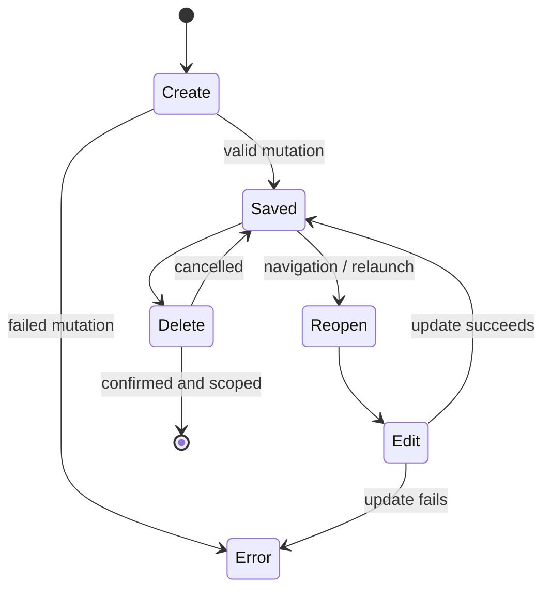
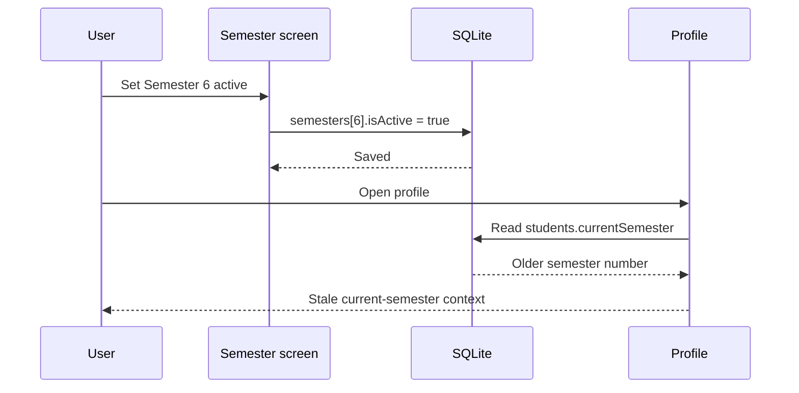
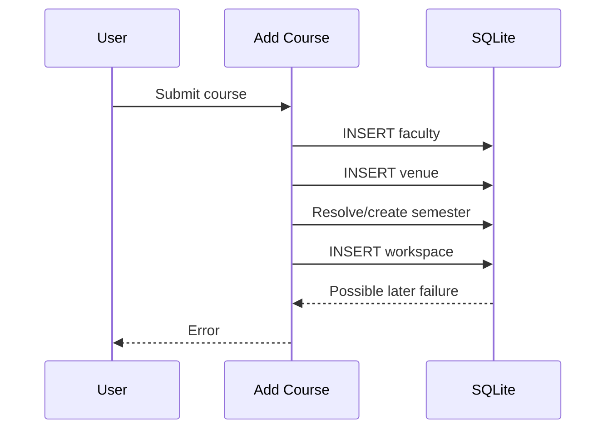
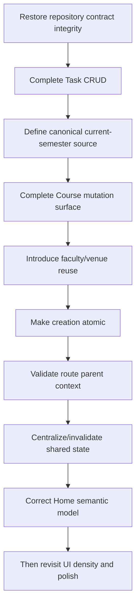

# UniOS — Phase 5 Audit: Functional, Reliability & Edge-Case Attack

| Field | Value |
| --- | --- |
| Project | UniOS |
| Repository | `aashu035/UniOS` |
| Branch | `master` |
| Current commit | `f479c921dabfcdc70a0de049f758d0373486bd03` |
| Phase | Phase 5 — Functional, Reliability & Edge-Case Attack |
| Scope | CRUD integrity, mutations, invalid context, state refresh, destructive operations, placeholder behavior, release hygiene, latest regressions |
| Code changes | None |

## 1. Executive Summary

The latest codebase shows meaningful remediation of several Phase 1–4 defects, but the current build has a new high-severity regression: the Task Add screen calls `TaskRepository.createTask(...)` while the repository currently contains no `createTask` method.

The deeper forensic finding is that UniOS is transitioning from direct screen-level DB access toward repository-oriented domain boundaries, but the refactor is incomplete. At the same time, the application still has incomplete CRUD surfaces and multiple sources of academic context.

The current high-risk cluster is:

```
Partial repository refactor
        ↓
Broken / incomplete mutation boundary
        ↓
CRUD gaps
        ↓
Workarounds and inconsistent screens
        ↓
Stale or invalid context risk
```

## 2. Functional Attack Model

The audit attacks each workflow as a state machine rather than only inspecting individual screens.



For each workflow, the audit asks:

1. Is the mutation actually wired?
2. Does the UI represent the persisted truth after returning?
3. Does refresh/reopen preserve the change?
4. Is the context still valid?
5. Does delete remove only intended data?
6. Is there a recoverable error state?

## 3. Core Workflow Attack Matrix

| Workflow | Create | Read | Update | Delete | State refresh | Current verdict |
| --- | --- | --- | --- | --- | --- | --- |
| Profile | Yes | Yes | Yes | N/A/unclear | Good local hook update | Partial |
| Semester | Yes | Yes | Partial | Repo-only | Focus/hook based | P1 lifecycle gap |
| Course | Yes | Yes | **Partial** | Yes | Focus based | **P1/P0 lifecycle gap** |
| Task | **Broken repository call** | Yes | Status only | Missing | Focus based | **P0** |
| Resource | Yes | Yes | Missing | Yes | Focus based | P1/P2 |
| Attendance | Yes | Yes | Yes/change | Delete not verified | Refresh after mutation | Partial |
| Calendar | Add flow exists | Planner read | Edit/delete route not evident | Not verified | Hook based | Unverified |
| AI Tutor | Conversation creation/read | Yes | Message append | Not verified | Local state + repository | Functional core, deeper context unverified |

## 4. Confirmed P0 — Task Add Calls a Missing Repository Method

### Evidence

`app/task/add.tsx` invokes:

`TaskRepository.createTask(...)`

The current `domains/task/repository.ts` contains:

- `getTasksForWorkspace`
- `getPendingTasks`
- `updateTaskStatus`

There is no `createTask` method in the inspected repository file.

### Finding P5-01

**Category:** Functional / regression

**Severity:** P0

**Status:** Confirmed by static source comparison

**Expected:** The Add Task screen must call an implemented repository method or an equivalent valid service boundary.

**Observed:** The screen calls a method absent from the repository contract.

**Impact:** The core Add Task workflow is currently broken at the implementation boundary and should fail TypeScript validation unless an external declaration/augmentation exists.

**Audit limitation:** TypeScript was not executed in this pass; this report does not claim a captured compiler output.

**Root cause cluster:** Incomplete domain repository refactor.

## 5. P1 — Task CRUD Is Incomplete

The SRS requires tasks to be created, edited, status-updated, and deleted. Current TaskRepository exposes list/read and status update only. The route tree shows an add screen but no task edit or delete route.

### Finding P5-02

**Category:** CRUD completeness

**Severity:** P1

**Status:** Confirmed from current route/repository inventory plus normative SRS requirements.

**Expected:** Full legitimate task lifecycle without direct database access workarounds.

**Observed:** Create call is broken, update is limited to status, delete is absent, and no task edit screen is present in the current route tree.

**Impact:** Normal task maintenance becomes incomplete even aside from the current create regression.

## 6. P1 — Course/Subject Update Remains Incomplete

The current Course edit screen only writes:

- `name`
- `code`
- `targetAttendance`

The course model and SRS include additional mutable fields such as credits, type, instructor, default venue, colour and notes.

### Finding P5-03

**Category:** Editability / product contract

**Severity:** P1

**Status:** Confirmed

**Impact:** A legitimate user change can remain impossible without destructive delete/recreate behavior.

**Root cause:** The mutation surface is narrower than the canonical entity model and requirement baseline.

## 7. P1 — Current Semester Source of Truth Remains Bidirectional

Profile changes now synchronize `students.currentSemester` → `semesters.isActive`.

However, semester activation via `SemesterRepository.updateSemester(..., { isActive: true })` changes semester state without updating `students.currentSemester`.

### Finding P5-04

**Category:** Data consistency / context

**Severity:** P1

**Status:** Confirmed

### Failure scenario



**Impact:** Different screens may answer “what semester am I in?” differently.

## 8. P1 — Faculty / Venue Duplication Still Exists

Course creation inserts `faculty` and `venues` rows directly from free-text names.

There is no visible existing-entity lookup or reuse step and no uniqueness constraint on name in the inspected models.

### Finding P5-05

**Category:** Data integrity / smart reuse

**Severity:** P1

**Status:** Confirmed creation path

**Impact:** Repeatedly assigning the same instructor or room can produce multiple records representing the same real-world entity.

## 9. P1 — Course Creation Can Leave Orphan Faculty/Venue Rows

The add-course sequence is:



Faculty and venue inserts occur before the final workspace creation. Without a transaction spanning the full operation, a later failure can leave orphan rows.

### Finding P5-06

**Category:** Data integrity

**Severity:** P1

**Status:** Strong inference from operation ordering; transaction behavior not implemented in the inspected screen.

**Expected:** One atomic course-creation operation or explicit rollback/compensation.

**Impact:** Failed course creation can leave behind entities that the user never intentionally created as standalone records.

## 10. P1/P2 — Task Route Context Is Not Validated

When `workspaceId` is provided, Add Task filters the loaded workspace list to find a matching course for display. However, the save operation still uses the raw numeric route parameter.

### Potential failure

```
/workspace/999/task/add
        ↓
No matching course displayed
        ↓
selectedWorkspaceId remains 999
        ↓
Save attempts workspaceId=999
```

### Finding P5-07

**Category:** Context validation / foreign-key integrity

**Severity:** P1/P2

**Status:** Strong inference; exact DB failure depends on SQLite/Drizzle behavior for the specific FK scenario.

**Expected:** Invalid parent context should be rejected before save with a clear recovery path.

## 11. P1 — Home “Attendance Alerts” Is Not an Alerts Calculation

The Home screen labels the section `Attendance Alerts`, but it maps the first two workspaces into `SubjectCard` components using `ws.targetAttendance` as the `attendancePercentage` prop and does not pass a `workspaceId`.

`SubjectCard` only performs live attendance retrieval when a `workspaceId` is provided. Therefore this Home section renders the configured attendance target rather than the calculated attendance percentage for those subjects.

### Finding P5-08

**Category:** Data presentation / trust

**Severity:** P1

**Status:** Confirmed by current code path

**Expected:** An alert section should identify subjects at risk using actual attendance metrics, or be explicitly labelled as a target overview.

**Observed:** The section title implies risk detection while the displayed ring can represent the configured target threshold.

**Impact:** A student can receive a visually authoritative but semantically incorrect attendance signal.

## 12. P1/P2 — Home Remains an Aggregate Duplication Surface

Home still contains:

- Today's Schedule
- Today's Focus
- Attendance Alerts
- Recent Uploads / Notes

These map onto Planner, Tasks, Subject, and Knowledge/Resource surfaces respectively.

Duplication is not automatically wrong for a dashboard, but the current implementation does not consistently distinguish “attention item” from “repeated list”.

### Finding P5-09

**Category:** Information architecture

**Severity:** P1/P2

**Status:** STILL VALID from Phase 4, re-confirmed in current code.

**Recommended direction:** Home should surface actionable exceptions and deep-link to canonical screens, not reproduce large portions of those screens.

## 13. P1/P2 — Presentation Component Owns Domain Fetching

`SubjectCard` can call `useAttendanceMetrics()` internally whenever `workspaceId` is passed.

### Finding P5-10

**Category:** Architecture / performance / consistency

**Severity:** P1/P2

**Status:** Confirmed

**Impact:** Rendering a list of subjects can trigger per-card domain fetching and make visual composition responsible for data orchestration. This increases duplication of reads and complicates source-of-truth reasoning.

## 14. P2 — Search Results Do Not Open the Matched Entity

Search results cover courses, tasks, and resources. For results with a `workspaceId`, the current route always navigates to `/workspace/{workspaceId}`.

### Finding P5-11

**Category:** Search / navigation

**Severity:** P2

**Status:** Confirmed

**Impact:** Search for a task/resource behaves more like subject search than entity search. The user still needs another action to find the actual matched item.

## 15. P1/P2 — Resource Deletion Can Leave an Orphaned Local File

`ResourceRepository.deleteResource()` deletes the database record first and then attempts to delete a managed local file.

If local file deletion fails, the DB record is already gone and the file remains on disk.

### Finding P5-12

**Category:** Data/storage integrity

**Severity:** P1/P2

**Status:** Confirmed control flow

**Impact:** Storage can accumulate files that are no longer referenced and cannot be discovered through the normal resource list.

The repository comment intentionally prioritizes preserving the file on storage failure; however, the product currently has no visible orphan-file cleanup path in the inspected surface.

## 16. P1/P2 — Runtime Database Artifacts Are Committed

The current tree contains:

- `.freebuff/desktop-v2.db`
- `.freebuff/desktop-v2.db-shm`
- `.freebuff/desktop-v2.db-wal`

### Finding P5-13

**Category:** Release hygiene / privacy / repository hygiene

**Severity:** P1/P2

**Status:** Confirmed artifact presence; data sensitivity unverified

**Impact:** Development database artifacts can accidentally expose local test data and are not appropriate release-source artifacts unless explicitly intended.

## 17. P2 — Placeholder Insights Still Exists as Reachable Code

The `insights.tsx` route still contains placeholder chart panels, even though the latest commit removes `Insights` from the primary subject tab bar.

### Finding P5-14

**Category:** Product completeness

**Severity:** P2

**Status:** Partially fixed historical finding

**Impact:** The product has correctly stopped advertising the feature in primary subject navigation, but the underlying route remains a placeholder implementation.

## 18. Functional Failure-State Matrix

| Failure condition | Expected state | Current evidence | Severity |
| --- | --- | --- | --- |
| Task create repository mismatch | Visible build/test failure before release | Missing method detected statically | P0 |
| Invalid workspaceId in task route | Clear invalid-context error | Raw ID may reach save | P1/P2 |
| Course update unsupported field | Field should remain editable | Current form omits fields | P1 |
| Faculty/venue duplicate | Reuse existing entity | Always inserts from entered name | P1 |
| Course creation fails late | Roll back all provisional child rows | No transaction visible | P1 |
| Semester activated independently | Profile context updates | Reverse sync absent | P1 |
| No attendance warning | Explicit “no alert” state | Home shows target ring under Alerts | P1 |
| Resource file-delete failure | User can recover/cleanup | DB row is removed first | P1/P2 |
| Search task/resource | Open matched item | Opens parent workspace | P2 |
| Insights unavailable | No misleading primary destination | Primary tab removed; route remains placeholder | P2 |

## 19. CRUD Matrix

| Entity | Field-level update coverage | Lifecycle risk |
| --- | --- | --- |
| Profile | Name, branch, enrolment, semester, target CGPA, avatar | Current semester semantics duplicated |
| Semester | Activation / partial metadata through repository | Reverse sync, missing visible full edit/delete UI |
| Course | Name, code, attendance target | Credits/type/faculty/venue/color/notes missing |
| Faculty | Create/read only in inspected surfaces | No normal mutation lifecycle |
| Venue | Create/read only in inspected surfaces | No normal mutation lifecycle |
| Task | Status update | Create currently broken; edit/delete absent |
| Resource | Create/read/delete | Update/rename absent |
| Attendance | Mark/change | Full delete behavior not verified |
| Calendar event | Add route visible | Full edit/delete lifecycle not established |

## 20. Smart Detection Audit Matrix

| Input/context | Already known? | Auto-fill/reuse | Should infer? | Confirmation rule | Current status |
| --- | --- | --- | --- | --- | --- |
| Task parent from subject route | Yes | Yes | No | No | Partially implemented |
| Semester when adding course | Usually | Yes | Only from canonical current context | Confirm only if ambiguous | Partially implemented |
| Faculty typed name | Possibly | Search/reuse | Fuzzy suggestion only | Yes for ambiguous matches | Missing |
| Venue typed name | Possibly | Search/reuse | Fuzzy suggestion only | Yes for ambiguous matches | Missing |
| Subject target attendance | Existing course value during edit | Yes | No | No | Implemented |
| Current semester after semester activation | Yes | Synchronize profile | No | No | Missing reverse sync |
| Search task/resource destination | Exact result known | Open exact entity | No | No | Missing |

## 21. Root-Cause Clusters

### Cluster A — Incomplete repository refactor

```
New screen/domain boundary
        ↓
Repository call introduced
        ↓
Repository contract not completed
        ↓
Runtime/build risk
```

Findings: P5-01, P5-02.

### Cluster B — Multiple sources of academic context

```
students.currentSemester
        ↕
semesters.isActive
        ↓
Different screens choose different answers
```

Findings: P5-04 plus historical P3-01/P3-05/P4-09.

### Cluster C — Fragmented entity lifecycle

```
Rich database model
        ↓
Narrow add/edit UI
        ↓
Missing legitimate mutations
        ↓
Delete/recreate temptation
```

Findings: P5-03 and historical P1-03/P3-06.

### Cluster D — Weak entity reuse

```
Known person/venue
        ↓
Free-text input
        ↓
INSERT new entity
        ↓
Duplicate rows
```

Findings: P5-05 plus historical P1-04/P1-05/P1-10.

### Cluster E — UI/domain responsibility leakage

```
Visual card
        ↓
Domain fetch
        ↓
Per-card data reads
        ↓
Hidden performance/state coupling
```

Finding: P5-10.

### Cluster F — Dashboard semantics drift

```
Target value
        ↓
Presented under "Alerts"
        ↓
User interprets as risk
        ↓
Wrong decision signal
```

Finding: P5-08.

## 22. Reliability Assessment

| Dimension | Current rating | Rationale |
| --- | --- | --- |
| Architecture | 6/10 | Domain separation is useful, but boundaries are still inconsistent |
| Information Architecture | 6/10 | Primary nav improved; Home remains over-aggregated |
| UX | 5/10 | Several contextual and lifecycle gaps remain |
| UI consistency | 7/10 | Shared component system is reasonably organized |
| Data integrity | 4/10 | Duplicate entities, context drift, transaction/orphan risk |
| CRUD completeness | 4/10 | Course and Task lifecycles incomplete |
| State management | 5/10 | Focus refresh works as mitigation, but local copies remain distributed |
| Contextual intelligence | 5/10 | Some route context inheritance exists; reuse is inconsistent |
| Reliability | 4/10 | Current task repository mismatch is a release-blocking concern |
| Release readiness | 3/10 | Static regression + incomplete CRUD + committed runtime DB artifacts |

These are audit ratings, not automated test scores.

## 23. Top 10 Current Issues

| Rank | Finding | Severity |
| --- | --- | --- |
| 1 | Task Add calls missing `TaskRepository.createTask` | **P0** |
| 2 | Course editing remains materially incomplete | **P1** |
| 3 | Task CRUD is incomplete beyond the broken create call | **P1** |
| 4 | Current-semester context can diverge between profile and semester entity | **P1** |
| 5 | Faculty/venue duplicate creation remains the default | **P1** |
| 6 | Home Attendance Alerts can display target attendance instead of actual risk | **P1** |
| 7 | Course creation can leave provisional faculty/venue rows after later failure | **P1** |
| 8 | Home remains an information duplication surface | P1/P2 |
| 9 | SubjectCard performs hidden attendance fetching | P1/P2 |
| 10 | Runtime DB artifacts are committed to repository | P1/P2 |

## 24. Recommended Remediation Sequence

Do not begin by polishing cards or changing visual styles.



### Ordering rationale

1. A broken repository call is a release blocker.
2. CRUD completeness prevents users from falling into destructive workarounds.
3. Canonical context prevents new duplication while fixing flows.
4. Entity reuse and transactional creation protect data integrity.
5. State architecture should be stabilized before large UI refactors.
6. Home and visual consolidation should be redesigned against the corrected data model.

## 25. Confirmed vs Inference vs Hypothesis

### Confirmed

- Current branch/head and repository tree state.
- Semester primary tab removed.
- AI Tutor promoted to primary navigation.
- Task Add calls `TaskRepository.createTask` while repository file lacks that method.
- Course edit writes only name/code/targetAttendance.
- Profile update mutates active semester state.
- Semester update can mutate active semester without profile synchronization.
- Faculty/venue rows are inserted directly from free-text course creation.
- Home Attendance Alerts passes target attendance to SubjectCard without a workspace ID.
- SubjectCard can fetch attendance inside the presentation component.
- Insights route remains placeholder while no longer in primary workspace tabs.
- Runtime DB artifacts are committed in `.freebuff/`.

### Strong inference

- Task add is likely to fail TypeScript validation because the repository contract lacks the called method.
- Late course-create failures can leave orphaned faculty/venue rows because the visible operation is not transactional.
- Invalid workspace route IDs can reach task persistence.

### Hypotheses / unverified

- Exact runtime cascade behavior for invalid task workspace IDs on all release configurations.
- Exact sensitivity of committed `.freebuff` database contents.
- Whether calendar events have complete update/delete UI elsewhere in the route tree.
- Whether AI Tutor actually injects persistent subject/material context beyond conversation history in all modes.

## 26. Phase 5 Conclusion

The latest codebase is healthier than the previous snapshot in several UX-facing areas, but it is not release-ready.

The primary finding has shifted from “too many duplicated screens” to **“the new implementation boundaries are not yet internally coherent.”** The project is now removing old UI duplication while simultaneously introducing domain-layer abstractions, and that transition has created at least one direct regression.

The highest-value next audit area is therefore:

> **Core academic entity lifecycle hardening — Course + Task + Semester, including full field-level CRUD, canonical current-semester semantics, transactional creation, and cross-screen state invalidation.**
> 

**Phase 5 disposition: Complete. No UniOS source code changed.**