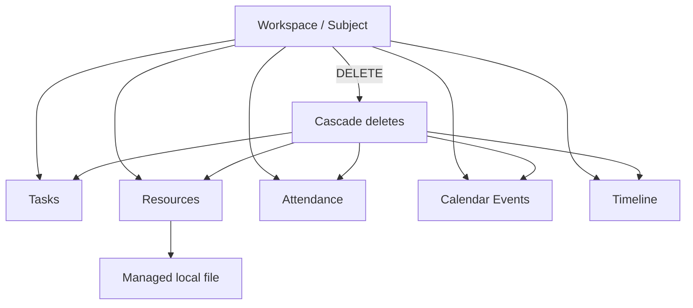

# UniOS — Phase 6 Audit: Cross-Domain Integrity & Destructive Operations

This phase follows the approved lifecycle-ownership implementation plan but does **not** modify source code. It stress-tests the remaining cross-domain integrity risks in the current `master` implementation before execution.

## Current code baseline

- Repository: `aashu035/UniOS`
- Branch: `master`
- Current audited implementation: post-Phase-5 audit state
- Audit mode: forensic code/integrity review
- Code changes made: none

## 1. Key finding

The approved Phase 5 implementation plan correctly fixes Task CRUD, Course lifecycle ownership, and semester synchronization. However, the current database design reveals a second layer of integrity risks that should be addressed or explicitly deferred before implementation.



The relational database can cascade child rows, but filesystem side effects and externally referenced entities are not automatically part of the same transaction.

## 2. Workspace deletion is broader than the UI wording implies

`WorkspaceRepository.deleteWorkspace()` relies on SQLite foreign-key cascades and states that tasks, resources, attendance and timeline records are deleted by the database. The workspace model confirms cascading for the workspace timeline; task, resource, attendance and calendar models also reference workspace with cascade behavior.

### Finding P6-01 — Destructive workspace cascade has multiple child domains

**Severity: P1**

Deleting a Subject is not a simple record deletion. It can remove:

- tasks
- resources
- attendance history
- calendar events
- workspace timeline

This is acceptable only if the product clearly communicates the complete blast radius and every filesystem/external side effect is handled consistently.

The current course delete confirmation mentions tasks, materials and timeline events, but the implementation also cascades attendance and calendar records. That is a disclosure gap.

### Expected UI contract

```
Delete Subject
    ↓
Show complete impact
    ↓
Tasks
Resources
Attendance history
Calendar events
Timeline
    ↓
Explicit confirmation
```

## 3. Resource deletion is not transactionally coupled to database deletion

`ResourceRepository.deleteResource()` deletes the database row first and then attempts to remove a managed `file://` asset from disk. Failure to delete the file is caught and logged.

### Finding P6-02 — Database/file lifecycle can diverge

**Severity: P1/P2**

A successful database deletion followed by a failed filesystem deletion leaves an orphaned local file. The current implementation intentionally prioritizes preserving the file if the DB deletion fails, but the reverse situation is still possible.

This should not necessarily be solved with a database transaction because SQLite transactions cannot atomically roll back a filesystem operation. Instead, the lifecycle contract should explicitly define:

```
DB delete succeeds
→ file delete attempted
→ failure recorded / repairable
```

The system should maintain enough metadata to identify orphaned managed files later.

## 4. Workspace deletion can create the same filesystem problem at a larger scale

`WorkspaceRepository.deleteWorkspace()` explicitly states that the caller is responsible for filesystem operations for resources before deleting the workspace. This means destructive behavior crosses the repository boundary.

### Finding P6-03 — Destructive operation violates the new lifecycle-ownership principle

**Severity: P1**

The Phase 5 plan correctly says repositories should own lifecycle rules, yet the current workspace deletion contract says the caller handles file deletion.

This is a direct architecture inconsistency:

```
NEW RULE
Repository owns lifecycle

CURRENT DELETE
Screen/caller owns resource filesystem cleanup
```

Recommended direction: introduce a domain-level `deleteWorkspace()` service that orchestrates DB cascade + managed-file cleanup + recoverable failure reporting, rather than making screens responsible for subordinate cleanup.

## 5. Calendar events are also children of a Subject

The calendar model has `workspaceId` with `onDelete: cascade`. Therefore deleting a subject can remove schedule/calendar events too.

### Finding P6-04 — Delete confirmation understates calendar impact

**Severity: P1/P2**

The user may think they are deleting only the subject metadata while actually removing its schedule events. This is especially important because Planner is a primary navigation surface and calendar data has independent user value.

Recommended direction: include schedule/calendar impact in the destructive confirmation or offer an explicit archive/unlink behavior where appropriate.

## 6. Venue is referenced by both Workspace and Calendar

A venue can belong to a workspace through `workspace.venueId`, and calendar events can separately reference a venue override.

This is a good model for temporary room changes, but it means Faculty/Venue lifecycle operations should never assume a venue is owned by one subject.

### Integrity rule

```
Venue deletion
    ↓
Only allowed when no active references exist
    OR
references are explicitly nulled/reassigned
```

This supports the approved non-destructive Course Edit rule: changing a Course's venue should not delete the old venue entity.

## 7. Attendance has a duplicate-date protection problem

`AttendanceRepository.markAttendance()` checks whether a record exists for the same `workspaceId` and `date`; if found, it updates the first match. However, the attendance model does not show a database-level unique constraint on `(workspaceId, date)`.

### Finding P6-05 — Application-level uniqueness without database enforcement

**Severity: P1**

Two competing writes could theoretically create duplicate attendance records for the same subject/date before either sees the other's insert.

The repository currently assumes the pair is unique but the schema does not enforce that invariant.

Recommended direction:

```
UNIQUE(workspace_id, date)
```

plus repository upsert/update logic.

Do not rely solely on application-level existence checks for a structural uniqueness rule.

## 8. Portal attendance introduces a second attendance source

The schema has local `attendance` plus `portal_attendance`. The repository exposes both separately.

### Finding P6-06 — Dual attendance sources require explicit precedence

**Severity: P1/P2**

UniOS can have:

```
local attendance history
portal attendance snapshot
```

These are conceptually different, but the product needs a documented rule for when a summary should show one versus the other.

Without a source-precedence contract, a user could see:

- one percentage in Subject Overview
- another in Attendance
- another from portal sync

Recommended direction: define the semantic roles explicitly:

| Source | Role |
| --- | --- |
| Local attendance | authoritative editable history for UniOS tracking |
| Portal attendance | external snapshot / reconciliation source |
| Summary percentage | derived from one declared source |

## 9. Semester deletion is currently unconstrained by product ownership

`SemesterRepository.deleteSemester()` directly deletes the semester row. The workspace model references the semester, but the inspected relation does not explicitly specify a cascade for workspace deletion.

### Finding P6-07 — Semester deletion behavior is undefined for owned subjects

**Severity: P0/P1**

The verification plan correctly includes “Delete semester — define behavior when it owns courses,” but this needs to become a **pre-implementation contract**, not just a manual test.

Possible policies:

```
A. Block deletion when courses exist
B. Require explicit cascade confirmation
C. Archive semester instead of deleting
```

For an academic history product, **A or C is safer** than silently deleting dependent subjects.

## 10. Semester activation must reject invalid targets

The planned `activateSemester(semesterId)` needs to verify the target exists before changing the current state.

Required invariant:

```
invalid semesterId
    ↓
NO state changes
```

It must not execute “deactivate all” and only then discover that the requested semester does not exist.

## 11. Empty-state and first-run integrity

`useSemesters()` loads all semesters and active semester independently. `addSemester()` then refreshes. The application can therefore represent a state where semesters exist but none is active because `addSemester()` defaults `isActive` to false.

### Finding P6-08 — Valid-looking database state with no canonical active semester

**Severity: P1/P2**

This is compatible with the current model but conflicts with workflows that expect a canonical current semester for creating subjects.

The approved Phase 5 change must define one of:

```
first semester automatically becomes active
OR
course creation is blocked until user activates one
```

It should not silently create a semester as a course-creation side effect.

## 12. Cross-domain deletion matrix

| Parent | Child | Current DB behavior | Product risk |
| --- | --- | --- | --- |
| Workspace | Task | Cascade | Data loss if parent delete is mistaken |
| Workspace | Resource | Cascade | DB + filesystem divergence |
| Workspace | Attendance | Cascade | Historical data loss |
| Workspace | Calendar event | Cascade | Schedule loss |
| Workspace | Timeline | Cascade | History loss |
| Semester | Workspace | No explicit cascade evidence | Undefined delete semantics |
| Faculty | Workspace | Reference exists | Shared entity; should not be blindly deleted |
| Venue | Workspace / Calendar | References exist | Shared entity; should not be blindly deleted |

## 13. Root-cause cluster

### Cluster K1 — Destructive parent deletion is insufficiently modeled

```
Parent deletion
      ↓
Many child domains
      ↓
Cascades + filesystem side effects
      ↓
Incomplete user disclosure
      ↓
Potential irreversible data loss
```

### Cluster K2 — Database invariants are partly application-enforced

Examples:

- attendance uniqueness
- exactly one active semester
- semester/workspace ownership rules

These should be backed by schema constraints wherever technically appropriate.

## 14. Required additions to the approved implementation plan

Before implementation begins, add:

1. **Workspace deletion orchestration** — repository/service owns child cleanup and complete impact reporting.
2. **Semester deletion policy** — block/archive/delete-cascade explicitly defined before coding.
3. **Attendance uniqueness constraint** — `(workspaceId, date)` must be structurally unique.
4. **Current-semester invariant** — successful activation must leave exactly one active semester and synchronized profile context.
5. **Resource filesystem orphan policy** — define repair/logging behavior when DB and filesystem cleanup diverge.
6. **Attendance source precedence** — local vs portal semantics documented before summary UI changes.

## 15. Priority register

| ID | Finding | Severity | Confidence | Action |
| --- | --- | --- | --- | --- |
| P6-01 | Workspace deletion cascades across more domains than UI disclosure states | P1 | Confirmed | Amend delete contract |
| P6-02 | Resource DB/file deletion can diverge | P1/P2 | Confirmed | Add repair policy |
| P6-03 | Workspace delete leaves filesystem cleanup to caller | P1 | Confirmed | Move lifecycle orchestration into domain |
| P6-04 | Calendar events are silently deleted with workspace | P1/P2 | Confirmed | Explicitly disclose/define behavior |
| P6-05 | Attendance uniqueness is only application-enforced | P1 | Confirmed | Add DB constraint |
| P6-06 | Local and portal attendance have no explicit summary precedence contract | P1/P2 | Confirmed | Define source semantics |
| P6-07 | Semester delete behavior with child workspaces is undefined | P0/P1 | Confirmed risk | Define policy before implementation |
| P6-08 | Semester records can exist with no active semester | P1/P2 | Confirmed | Define first-semester policy |

## 16. Next audit target

The next highest-value audit area is **Resource / Knowledge Hub lifecycle + Search**, because resources cross UI, database, local filesystem, search indexing, subject context and deletion semantics. It is the most likely place where another local fix could accidentally create a cross-domain regression.

**Disposition:** Phase 6 complete. No code changes made.