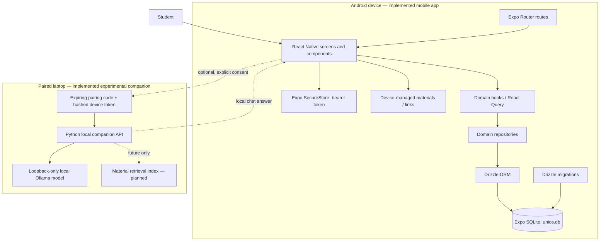
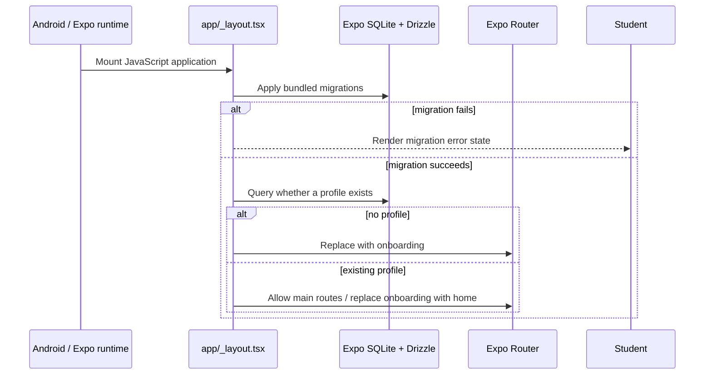
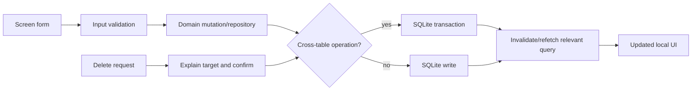
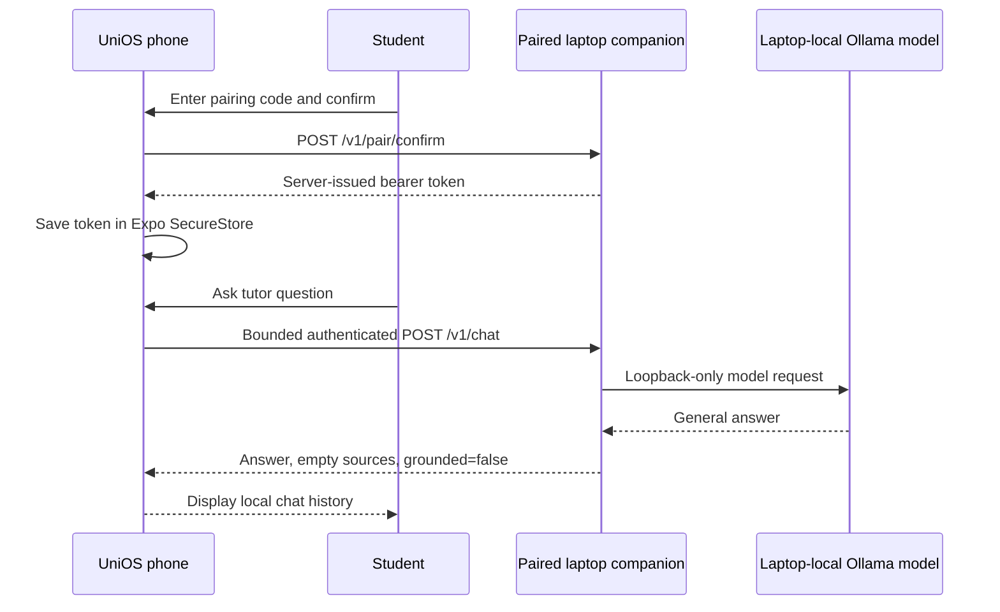

# UniOS Architecture

**Status:** Current mobile architecture plus an **implemented experimental** local-AI companion for pairing and chat. Material retrieval, cited answers, academic candidate creation, and encrypted/pinned transport are not implemented. See [Source of Truth](../SOURCE_OF_TRUTH.md) for authority and change control.

## Architectural goals

1. Keep academic planning, materials, and progress usable with no internet connection.
2. Store the student’s primary data locally on the phone.
3. Make UI actions fail visibly and recoverably rather than force-closing or loading forever.
4. Treat a stronger laptop model as optional, consent-based assistance—not a dependency of normal UniOS use.
5. Keep product, data, and technical contracts separable so the prototype can become maintainable software.

## Component view

## Implemented mobile layers

| Layer | Current responsibility | Primary locations |
| --- | --- | --- |
| Navigation/startup | Applies migrations, checks whether a profile exists, routes between onboarding and main tabs, hosts modal routes. | `app/_layout.tsx`, `app/(main)/_layout.tsx`, `app/**` |
| Presentation | Screen compositions, reusable cards/layout/feedback elements, design tokens. | `app/**`, `components/**`, `tokens/**` |
| Domain access | Query/mutation hooks and repository methods for profile, workspace, task, calendar, resource, and attendance operations. | `domains/*/hooks.ts`, `domains/*/repository.ts` |
| Data model | Drizzle SQLite table declarations and schema re-exports. | `domains/*/model.ts`, `core/db/schema.ts` |
| Local persistence | Opens the device database named `unios.db`; passes Drizzle schema; applies migration bundle. | `core/db/client.ts`, `drizzle/**` |
| Material I/O | Chooses documents/images, opens links/files, and stores material metadata. | `expo-document-picker`, `expo-file-system`, `expo-linking`, `app/resource/**`, `domains/resource/**` |
| Local AI client | Discovers, pairs with, revokes, and sends bounded chat requests to a laptop companion. The bearer token is in Expo SecureStore, never in the app SQLite schema. | `app/settings/pairing.tsx`, `app/tutor/index.tsx`, `domains/ai/**` |
| Local AI server | Issues/revokes hashed device tokens and proxies authenticated chat to an already-running loopback Ollama runtime. | `companion/**` |

No remote application backend or cloud inference client is implemented in this repository. The companion accepts a local network request only after user-entered pairing; it sends model requests only to a loopback Ollama runtime on the laptop.

## Startup and routing flow

### Startup reliability rules

- A release APK must embed its JS bundle; a debug build may instead require Metro and is not a valid standalone distribution artifact.
- Migration/profile checks must always settle into a rendered success or error/retry state; they must not block indefinitely on the native splash.
- Any release splash claim is incomplete until a clean install and real-device log capture verify it.
- Startup data creation must not insert fabricated courses, attendance, tasks, planner entries, materials, or progress. Immutable grading data requires a separate, idempotent initialization rule.

## Academic data flow

For course/workspace deletion, child-record cleanup belongs in a single repository transaction. The database foreign keys currently use `ON DELETE NO ACTION`; see [ERD](ERD.md).

## Local-AI boundary (implemented experimental scope)

The phone is always the source of truth. The laptop is an optional local companion that performs model inference and retrieval only when explicitly paired and available.

The implemented service supports `GET /v1/health`, `POST /v1/pair/confirm`, `POST /v1/chat`, and `POST /v1/pair/revoke`; its tests prove health does not pair a device and chat requires the issued token plus matching device ID. The detailed contract and model policy are in [Local Companion Architecture](../ai/local-companion-architecture.md).

The current LAN transport is deliberately labelled experimental: it uses a short-lived pairing code and bearer token, but it does **not** yet provide TLS or certificate pinning. The companion does not ingest resources, perform retrieval, create cited answers, or create academic records. It returns `grounded: false` and no sources rather than pretending a general answer came from the student’s material.

## Data classification and privacy boundary

| Data class | Default location | May leave phone? | Control |
| --- | --- | --- | --- |
| Profile, courses, schedule, tasks, attendance, progress | Phone SQLite | No, except a selected AI request | App data remains locally useful offline. |
| Material metadata and local file references | Phone database/device storage | No background sync | User explicitly selects material for an AI request/index. |
| Approved material copy/index | Not implemented | No | Permission records exist, but no phone-to-laptop material upload/index path exists yet. |
| Tutor conversation | Phone by default; companion only for active request | Local pair only | History is optional and deletable. |
| Telemetry/API key/cloud prompt log | Nowhere | Never | Not part of UniOS. |

## Failure behaviour

| Condition | Required behaviour |
| --- | --- |
| Migration failure | Render a concise local error state; provide safe retry/recovery guidance; never remain on splash indefinitely. |
| Missing/invalid route parameter | Show an empty/not-found state, not a crash. |
| File-picker/open-file failure | Explain the failed action, retain unsaved form state where possible, and offer retry/cancel. |
| Database write failure | Do not optimistically claim success; show an error and keep/recover the draft. |
| Companion unavailable | Keep normal app fully usable; Tutor shows offline/retry/re-pair state within a bounded timeout. |
| AI extraction uncertainty | Mark uncertainty and require human confirmation before writing an event/task. |

## Deployment view

| Target | Delivered component | Operational requirement |
| --- | --- | --- |
| Android phone | Expo/React Native release APK with bundled JS and local SQLite migrations | Must start cleanly without Metro; core workflows work offline. |
| Developer environment | Node/Expo/Android toolchain | Commands and exact dependency versions belong in `TECH_STACK.md` and `README.md`. |
| Optional student laptop | Separate local companion process plus an already-running local Ollama model | Pair/chat is experimental on trusted LAN or USB-tether network; benchmark and secure transport before production labelling. |

## Architectural decision log

| Decision | Status | Rationale |
| --- | --- | --- |
| Phone-local SQLite is the primary academic data store | Implemented | Keeps core workflows available offline and under student control. |
| Drizzle migrations are the schema evolution mechanism | Implemented | Supports explicit, versioned local database changes. |
| No fake seeded academic data on fresh install | Approved / in progress | Demo data is misleading and cannot substitute for an empty-state guided setup. |
| Recurring class schedule groups need explicit weekday membership | Approved / in progress | A class must not appear on days the student did not choose. |
| Laptop-first local AI, no cloud API | Implemented experimental pair/chat | Pair/chat work through a local companion; model choice, retrieval, citations, and encrypted transport remain release gates. |
| Full model fine-tuning as baseline personalisation | Rejected for initial release | Explicit preferences, feedback, and retrieval are safer and more measurable first steps. |
