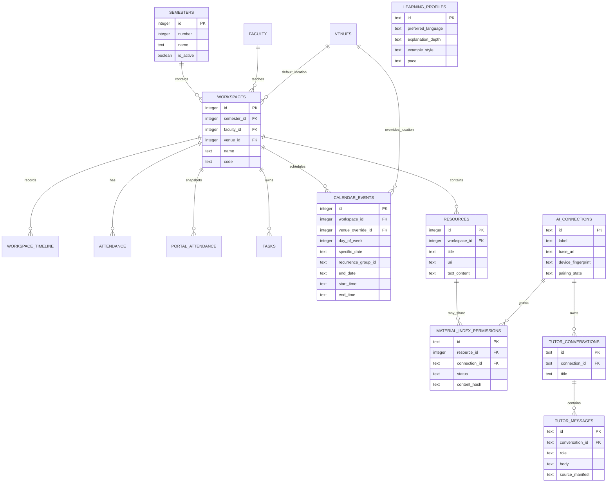

# UniOS Entity Relationship Diagram

**Status:** Implemented schema snapshot as of migration `0004_add_calendar_recurrence_and_remove_legacy_token`.

**Canonical sources:** `domains/*/model.ts`, `drizzle/0000_petite_dark_beast.sql` through `drizzle/0004_add_calendar_recurrence_and_remove_legacy_token.sql`, and `drizzle/meta/_journal.json`. This document describes the live schema; it does not authorize schema changes. See [Source of Truth](../SOURCE_OF_TRUTH.md).

## Current relationship model

## Entity dictionary

| Entity | Primary key | Foreign keys | Key notes |
| --- | --- | --- | --- |
| `students` | `id` | None | One profile is assumed by the repository (`LIMIT 1`), but the schema does not enforce one row. `current_semester` is not a foreign key. |
| `semesters` | `id` | None | Number, name, dates, type, active state, and SGPA are stored locally. Active-semester uniqueness is not enforced by the database. |
| `dcrust_grading` | `id` | None | `grade_letter` is the current schema’s declared unique value. |
| `faculty`, `venues` | `id` | None | Optional workspace instructor/default location; venue can also override a calendar event. |
| `workspaces` | `id` | `semester_id → semesters`, `faculty_id → faculty`, `venue_id → venues` | Presented as a course/subject. Holds code, credits, display colour, attendance target, and notes. |
| `workspace_timeline`, `attendance`, `portal_attendance`, `tasks` | `id` | `workspace_id → workspaces` | Course-scoped activity, local attendance, portal snapshots, and academic work. |
| `calendar_events` | `id` | `workspace_id → workspaces`, `venue_override_id → venues` | A one-time event uses `specific_date`; recurring class instances use `day_of_week`. `recurrence_group_id` links the selected weekday instances and `end_date` bounds the series. |
| `resources` | `id` | `workspace_id → workspaces` | Student-controlled document, link, image, or text-note metadata. `uri` is nullable for text-only notes. |
| `notifications` | `id` | None | Local in-app message/read-state/deep-link state. |
| `ai_connections` | text `id` | None | Companion label, local base URL, device identity, and pairing state. **It contains no bearer token**; the phone keeps that secret in Expo SecureStore. |
| `learning_profiles` | text `id` | None | Editable language, depth, example, pace, and accessibility preferences. The current table has no student foreign key. |
| `material_index_permissions` | text `id` | `resource_id → resources`, `connection_id → ai_connections` | Permission metadata for a future material-index operation; the ingestion/index workflow is not yet implemented. |
| `tutor_conversations` | text `id` | `connection_id → ai_connections` | Local tutor conversation metadata. |
| `tutor_messages` | text `id` | `conversation_id → tutor_conversations` | Local user/assistant message history and optional source manifest. |

## Referential integrity and deletion behaviour

The original academic foreign keys use SQLite `ON DELETE NO ACTION`; workspace deletion therefore remains a repository transaction that explicitly cleans dependent academic records. The AI relations introduced in `0003` deliberately use `ON DELETE CASCADE` for `resources → material_index_permissions`, `ai_connections → material_index_permissions`, `ai_connections → tutor_conversations`, and `tutor_conversations → tutor_messages`.

`material_index_permissions` records consent metadata only. It does not mean that a resource is currently copied to or indexed by a laptop.

## Migration mapping

| Migration | Effect reflected in this ERD |
| --- | --- |
| `0000_petite_dark_beast.sql` | Initial academic SQLite tables, foreign keys, and the `dcrust_grading.grade_letter` unique index. |
| `0001_deep_zaran.sql` | Makes `resources.uri` nullable; adds resource text/thumbnail fields and calendar title/description. |
| `0002_lonely_havok.sql` | Creates the original AI connection, profile, permission, conversation, and message tables. |
| `0003_curious_ozymandias.sql` | Repairs AI foreign keys and integer resource IDs; removes the obsolete `learning_profiles.student_id` relationship. |
| `0004_add_calendar_recurrence_and_remove_legacy_token.sql` | Adds calendar recurrence grouping/end date and removes the temporary ordinary-SQLite AI token column. |

## Known implementation gaps

1. The schema does not enforce one active semester, a unique semester number, or a one-profile rule.
2. A recurrence group is represented by repeated calendar-event rows with one shared ID; there is no separate schedule-group parent table yet.
3. Material-permission, learning-profile, and tutor-history tables exist, but material indexing/retrieval, cited answers, and editable profile UI are still separate future work.
4. Direct database deletion of an academic parent can still bypass repository cleanup; application code must use the tested repository path.
